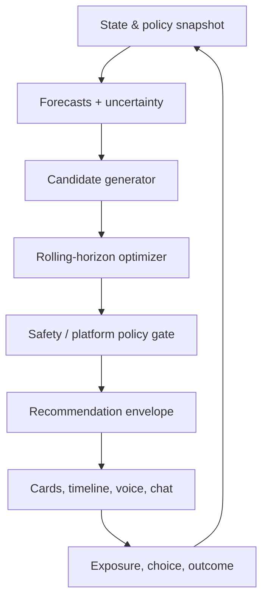

> ⚠️ **DEFERRED — 2026-07-20.** Tài liệu thuộc cách tiếp cận cũ (full multi-variable constrained optimization). Scope hiện hành: `CLAUDE.md` + `planning/SCOPE.md`. Chỉ dùng tham khảo (xem `tracking/DEFERRED.md`, mục D-001).

# 02 — System Specification

## 1. Logical flow

Explanation đọc `RecommendationEnvelope`; không nằm trên đường tính toán bắt buộc.

## 2. Bounded components

| Component | Responsibility | Không được làm |
| --- | --- | --- |
| State assembler | snapshot nhất quán, freshness/provenance | tự forecast hoặc fill missing bằng số bịa |
| Forecasting | distributions/quantiles cho demand, travel, charge, earnings components | quyết định action |
| Candidate generator | tạo plan/actions hợp lệ theo capability | xếp hạng cuối hoặc bypass policy |
| Optimizer | chọn Pareto/feasible plans theo objective/constraints | phát text, gọi dispatch |
| Policy gate | hard veto/capacity/feature flag/compliance | sửa numeric output để “trông hợp lý” |
| Recommender | envelope, expiry, dedupe, notification threshold | tính lại forecast |
| Explanation | why/compare/what-if intent/policy QA | tự tính số hoặc thay recommendation |
| Outcome evaluator | reconcile expected vs realized, metrics | coi accept là success mặc định |
| Simulator | synthetic/replay scenarios | đại diện cho causal production truth |

## 3. State machine

`OFFLINE → PLANNING → ACTIVE → BREAK/CHARGING → ACTIVE → HOMEWARD → ENDED`.

Transitions phải do event/policy xác nhận. LLM có thể đề xuất constraint/action request nhưng command handler validate. Các trigger replan: shift start, trip-completed aggregate, SOC threshold, bonus progress, forecast regime, policy update, constraint change, recommendation expiry, charger disruption hoặc periodic tick có debounce.

## 4. Core API (v1 draft)

| Method | Endpoint | Purpose |
| --- | --- | --- |
| `POST` | `/v1/state/snapshots` | ingest/assemble typed snapshot trong synthetic/internal mode |
| `POST` | `/v1/plans:optimize` | tạo baseline + ranked options |
| `GET` | `/v1/recommendations/{id}` | lấy immutable envelope |
| `POST` | `/v1/recommendations/{id}:respond` | accept/ignore/adjust reason |
| `POST` | `/v1/what-if` | chạy với overlay constraints, không mutate profile |
| `GET` | `/v1/shifts/{id}/summary` | post-shift analytics đã reconcile |
| `GET/PUT` | `/v1/drivers/{id}/preferences` | explicit preference/consent controls |
| `GET` | `/v1/health/data` | freshness/quality, không lộ data thô |

Mọi mutation nội bộ dùng idempotency key. External driver ID được pseudonymize ở analytics boundary.

## 5. Recommendation contract

`contracts/recommendation.schema.json` là contract chính. Envelope gồm:

- identity: recommendation, driver pseudonym, snapshot, trace;
- validity: generated/valid_from/expires_at/status;
- provenance: data/model/policy/optimizer/schema versions, data mode;
- baseline + tối đa ba options;
- numeric estimates với P10/P50/P90 hoặc lower/median/upper và currency/unit;
- hard-constraint check, platform guard, policy veto reason;
- confidence/calibration/freshness và caveat;
- presentation tokens, không phải prose tự do làm source of truth.

`recommended_option_id` có thể `null` khi expected delta không vượt threshold, confidence thấp, options gần như nhau hoặc policy không cho phép.

## 6. Explanation/tool contract

Allowed tools (read-only):

- `get_recommendation(recommendation_id)`;
- `compare_options(recommendation_id, option_ids)` — trả derived structured comparison;
- `run_what_if(recommendation_id, constraint_overlay)` — gọi core service;
- `get_metric_definition(metric_id)`;
- `get_policy_excerpt(policy_id, version)` — citation bắt buộc.

LLM output: `answer`, `referenced_option_ids`, `referenced_metric_ids`, `caveats`, `suggested_constraint_patch` (optional, user confirmation required). Numeric substring validator kiểm tra số được phép xuất hiện; nếu mismatch, fallback template.

## 7. Policy gate

Veto codes tối thiểu:

- `SAFETY_BREAK_REQUIRED`, `DRIVING_LIMIT_UNKNOWN/REACHED`;
- `BATTERY_RESERVE_RISK`, `CHARGER_DATA_STALE`;
- `POLICY_VERSION_UNKNOWN`, `ACTION_NOT_ALLOWED_FOR_PROFILE`;
- `PLATFORM_GUARD_FAILED`, `ZONE_CAPACITY_EXHAUSTED`;
- `FAIRNESS_BUDGET_EXCEEDED`, `DATA_FRESHNESS_FAILED`;
- `MOCK_DATA_IN_LIVE_MODE`, `CONSENT_SCOPE_MISSING`;
- `SOLVER_INFEASIBLE`, `SOLVER_TIMEOUT_NO_SAFE_SOLUTION`.

Legal/policy thresholds lấy từ versioned config service với effective dates; không hard-code trong prompt hay solver code.

## 8. Failure behavior

| Failure | Behavior |
| --- | --- |
| Forecast stale/missing | baseline + conservative heuristic hoặc no recommendation; show stale reason |
| Solver timeout có feasible incumbent | dùng FEASIBLE nếu qua policy, ghi status/gap; không gọi optimal |
| Solver infeasible | diagnose constraint set; safe template action; no relaxation safety |
| Policy service unavailable | fail closed cho action mới; cho xem current-plan metrics nếu an toàn |
| Explanation unavailable | render structured card/template; core vẫn hoạt động |
| Charger feed stale | không nêu trạm/wait exact; ưu tiên reserve/safety message |
| Capacity token race | atomic reserve; loser replan/downgrade, không oversubscribe |
| Data mode conflict | reject request và alert; không auto-convert |

## 9. Idempotency, concurrency và expiry

- Snapshot immutable; derived corrections tạo version mới.
- Optimize key: driver + snapshot + constraint hash + model/policy versions.
- Chỉ một active recommendation cho cùng action domain; card mới supersede card cũ.
- Phase 2 capacity reservation có TTL ngắn hơn recommendation expiry; consume/release audit được.
- User response sau expiry được ghi nhận UX nhưng không kích hoạt action cũ.

## 10. Security/privacy

- RBAC/ABAC theo service; explanation không đọc raw location/earning ledger.
- Encryption in transit/at rest; secrets manager; audit privileged reads.
- Log redaction và coarse geospatial analytics.
- Consent/purpose binding cho personalization; retention khác nhau cho operational, analytics và chat.
- Threat tests: prompt injection trong policy text, IDOR, replay/idempotency abuse, schema poisoning, mock-to-live leak và malicious location payload.

## 11. Observability

Một trace nối: snapshot → forecasts → candidate count → solver → policy → envelope → exposure → response → outcome. Metrics: latency, freshness, missingness, solver status/gap, veto reason, notification suppression, explanation fallback, realized residual và cost/request. Structured log không chứa exact home/location trace.
