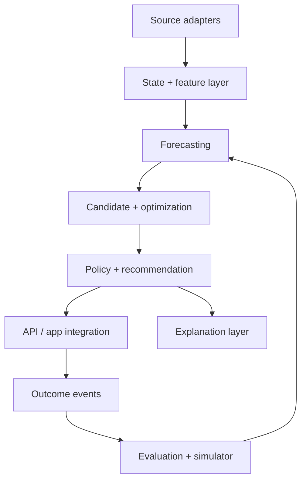

> ⚠️ **DEFERRED — 2026-07-20.** Tài liệu thuộc cách tiếp cận cũ (full multi-variable constrained optimization). Scope hiện hành: `CLAUDE.md` + `planning/SCOPE.md`. Chỉ dùng tham khảo (xem `tracking/DEFERRED.md`, mục D-001). Phân chia Dev A/Dev B trong §5 KHÔNG áp dụng — phân công thực tế ở `tracking/ASSIGNMENTS.md`.

# 06 — Architecture, Repository and CI/CD

## 1. Architecture choice

Team hai người nên bắt đầu bằng **modular monolith + background worker**. Boundary rõ trong code/contracts nhưng deploy ít đơn vị. Chỉ tách service khi có ownership, scale, isolation hoặc SLO thực tế chứng minh cần.



Explanation là optional dependency; core recommendation vẫn render qua template khi LLM unavailable.

## 2. Default stack and rationale

| Layer | Default | Rationale / trigger to change |
| --- | --- | --- |
| Language/domain | Python current supported release, typed | OR/ML ecosystem; pin exact version in lockfile |
| API/contracts | FastAPI + Pydantic + JSON Schema/OpenAPI | type validation, contract generation |
| OLTP/spatial | PostgreSQL + PostGIS | transactional + zone/spatial query |
| Cache/lock | Redis optional | TTL recommendation/capacity locks; omit until needed |
| Offline | Polars + DuckDB + Parquet | low-ops local/replay workflows |
| Forecast baseline | scikit-learn + LightGBM/XGBoost as justified | transparent strong baselines; no deep model by default |
| Optimization | OR-Tools CP-SAT/flow behind port | integer constraints, assignment/flow support |
| Model/experiment | MLflow or small metadata abstraction | versions/lineage; use existing platform if repo has one |
| Observability | OpenTelemetry + structured logs + metrics backend | trace end-to-end |
| Local | Docker Compose + Make/task runner | reproducible onboarding |
| Deploy | managed container + managed Postgres first | Kubernetes only after scale/ops need |
| Events | in-process/outbox interface → Redis Streams/Redpanda/Kafka later | avoid early infra lock-in |

Không pin latest version trong tài liệu; CI dependency policy và lockfile là source of truth. Kiểm tra license/security trước adoption.

## 3. Proposed repository tree

```text
repo/
├── AGENTS.md
├── README.md
├── pyproject.toml
├── uv.lock
├── apps/
│   ├── api/
│   └── worker/
├── packages/
│   ├── domain/
│   ├── contracts/
│   ├── data/
│   ├── forecasting/
│   ├── optimization/
│   ├── simulator/
│   ├── recommendation/
│   ├── policy/
│   ├── explanation/
│   └── evaluation/
├── configs/
│   ├── markets/
│   ├── policies/
│   ├── profiles/
│   └── scenarios/
├── data/
│   ├── fixtures/
│   └── synthetic/
├── docs/
│   ├── product/
│   ├── specs/
│   ├── adr/
│   ├── phases/
│   └── fixes/
├── tests/
│   ├── unit/
│   ├── property/
│   ├── contract/
│   ├── golden/
│   ├── scenarios/
│   ├── integration/
│   └── performance/
├── migrations/
├── scripts/
├── infra/
└── MEMORY.md
```

`domain` không phụ thuộc FastAPI/DB/solver SDK. Các package khác implement ports; no circular dependency. Shared contracts được versioned/published nội bộ.

## 4. Initial vertical slice

Một endpoint nhận `OptimizationRequest` synthetic, state assembler validate, deterministic forecast fixture trả quantiles, candidate generator tạo baseline + charge/break/homeward, CP-SAT/toy optimizer rank, independent policy gate veto, recommendation envelope trả về, template explanation render và trace được ghi. Không UI full, không live data, không reposition.

Acceptance: 10 scenarios, all invariants, deterministic seed, timeout/infeasible/stale failure, schema contract và zero order-level action.

## 5. Two-developer work split

| Dev A — Decision engine | Dev B — Product/integration layer |
| --- | --- |
| domain economic/state types | API/OpenAPI/auth/idempotency |
| synthetic generator/replay | recommendation lifecycle/expiry/dedupe |
| forecast interfaces/baselines | policy gate/feature flags |
| candidate/optimizer/solver adapter | explanation tools/templates/output validator |
| simulator/offline metrics | observability/integration fixtures |
| solver property/performance tests | contract/golden/security tests |

Integration sequence: freeze schema fixtures → both mock against contract → daily contract CI → pair on first end-to-end slice. Ownership không cấm review chéo; mỗi PR thay shared contract cần cả hai approve.

## 6. API/data boundaries

- Ports: `StateRepository`, `ForecastProvider`, `PolicyProvider`, `Solver`, `RecommendationStore`, `CapacityAllocator`, `OutcomeSink`, `ExplanationProvider`.
- Outbox cho committed recommendation/outcome events; consumer idempotent.
- DB migrations forward + tested rollback/roll-forward; effective-dated policy immutable.
- Cache không là source of truth cho ledger/policy/consent.

## 7. CI pipeline

### Pull request fast gates

1. format/lint/type/import-boundary.
2. unit/property/contract/golden tests.
3. JSON Schema/OpenAPI backward compatibility.
4. security/secrets/dependency/license scan.
5. synthetic/live isolation; PII/log redaction.
6. toy optimality, solver status/timeout/invariant suite.
7. docs links/PHASE/FIX/MEMORY consistency.

### Main/nightly gates

- all scenarios/replay subset; forecast calibration/drift baseline.
- solver performance/sensitivity; platform/fairness non-regression.
- migration/integration/chaos on stale/unavailable dependencies.
- prompt/tool injection and numeric-consistency eval.
- image/SBOM/sign/provenance.

### Release gates

- immutable artifact/model/policy/schema bundle.
- deploy staging, smoke/contract/data-quality checks.
- shadow → cohort canary → progressive ramp by flags.
- auto/manual rollback on safety/platform/data/latency thresholds.
- post-deploy observation and MEMORY/release note.

## 8. ML/optimization delivery

Code, model, policy và data schema có version riêng nhưng release bằng compatibility manifest. Model registry entry có training/eval data ranges, features, calibration, segment metrics, limitations và approval. Solver config/weights/policy threshold không sửa trực tiếp production; change qua reviewed config bundle, simulation/shadow gates và audit.

## 9. SLO and cost

Không đặt SLO giả trước benchmark. Xác định user deadline theo interaction: pre-shift có thể lâu hơn in-shift; policy/fallback phải nhanh. Theo dõi p50/p95/p99 từng stage, timeout budget, cache hit, solver scenario count, LLM tokens/cost và map/traffic calls. Optimization/explanation cache theo immutable snapshot/version; không cache qua policy effective change.

## 10. Operational readiness

- runbook: stale feed, solver degradation, policy outage, capacity leak, earnings mismatch, privacy incident.
- dashboards và alert owner; feature flags theo action/market/cohort.
- audit/replay từ trace; kill switch không cần deploy.
- support scripts chỉ read-only mặc định; no manual silent recommendation edit.
