# Week 2 Report — Driver Advisor Team

### Trần Quốc Khánh · Lưu Thiện Việt Cường · 23/07 – 01/08/2026

---

## Chúng em đang xây cái gì

Một trợ lý cho tài xế Xanh SM. Tài xế chạy cả ngày và liên tục phải tự trả lời những câu rất thực
tế: *giờ này nên đứng chờ ở đây hay chuyển sang khu khác? Còn kịp mốc thưởng hôm nay không? Đi đổi
pin lúc nào thì ít mất cuốc nhất?* Hiện tại mỗi người tự đoán một kiểu.

Sản phẩm không lái thay tài xế và **không can thiệp vào việc GSM chia cuốc** — nó chạy trên nền hệ
thống điều phối của GSM. Việc nó làm là: **tính giúp, giải thích, rồi để tài xế tự quyết**. Con số
do phần tính toán làm ra; phần AI chỉ diễn giải cho dễ hiểu. Nhờ tách vai như vậy, trợ lý **không
thể tự nói vống một con số** — đó là ràng buộc quan trọng nhất khi sản phẩm nói về thu nhập của
người khác.

**Ba mục tiêu tuần 2:** làm cho sản phẩm chạy được để xem tận mắt · dựng môi trường mô phỏng để đo
xem lời khuyên có thật giúp được không · trả lời câu hỏi khó nhất: *trợ lý còn hữu ích không khi nó
không được biết trước nhu cầu khách?*

---

## Sản phẩm hiện tại

| | |
| --- | --- |
| 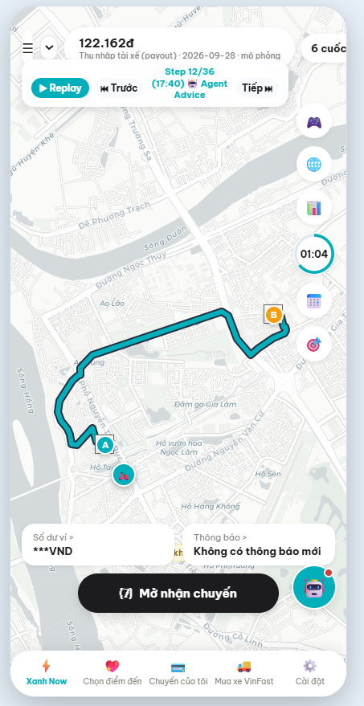 | 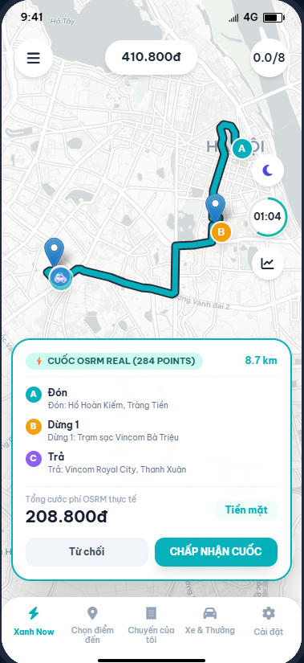 |
| **Xem lại một ngày chạy** — thu nhập cộng dồn theo từng cuốc, kèm các mốc trợ lý đã lên tiếng | **Cuốc trên đường thật** — tuyến lấy từ bản đồ thật, có chặng ghé trạm sạc |

Trợ lý **tự lên tiếng đúng lúc, không bắt tài xế đi tìm**:

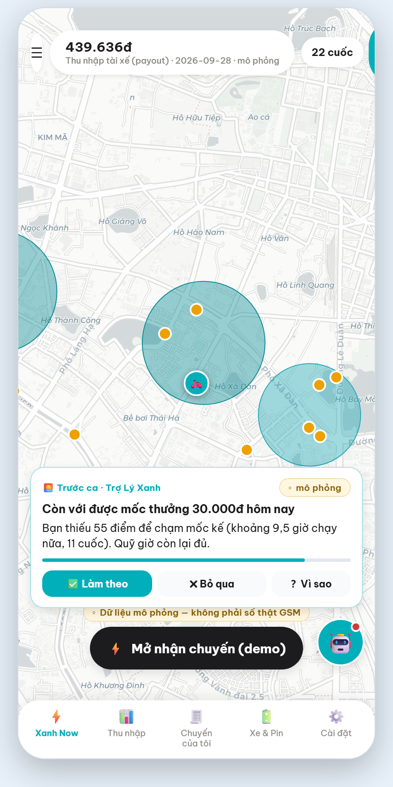

Thẻ tự hiện trước ca: *"Còn với được mốc thưởng 30.000đ hôm nay — bạn thiếu 55 điểm, khoảng 9,5 giờ
chạy nữa, 11 cuốc. Quỹ giờ còn lại đủ."* Ba điểm thiết kế có chủ ý:

- **Một việc, một lý do, một điều kiện** — không đổ cả bảng số liệu cho tài xế tự đọc.
- **Có nút để từ chối.** Bấm "Bỏ qua" thì chủ đề đó im một lúc. Trợ lý cũng không nói khi tài xế
  đang chở khách.
- **Có nút "Vì sao"** để xem trợ lý dựa vào đâu.

Nếu không có gì đáng nói, trợ lý **im lặng**. Một trợ lý nói ít mà đúng thì đáng tin hơn một trợ lý
nói suốt ngày.

| | |
| --- | --- |
| 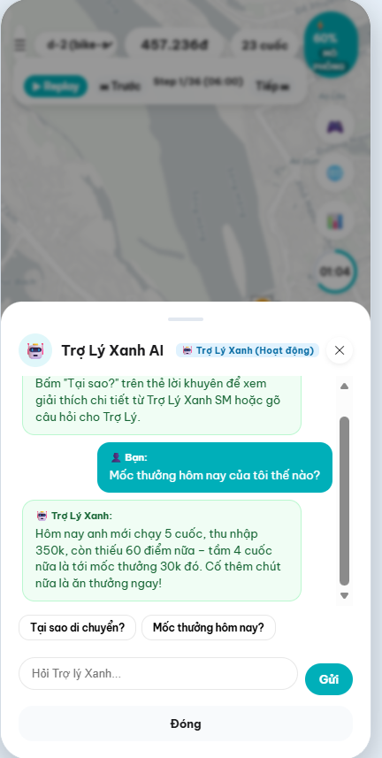 | 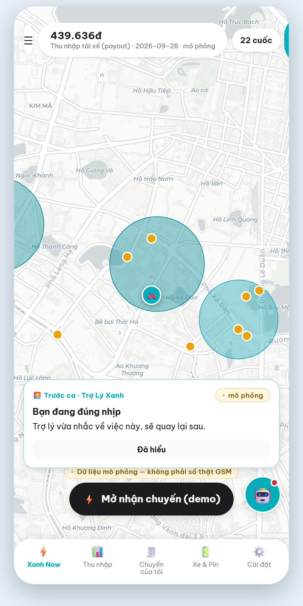 |
| Tài xế hỏi lại bằng tiếng nói thường ngày: *"Mốc thưởng hôm nay của tôi thế nào?"* | Màn theo dõi thu nhập trong ngày |

**Về tính năng:** trợ lý có 5 kênh gợi ý, nhưng hiện **chỉ 1 kênh được bật**. Bốn kênh còn lại bị
tắt vì **đo ra không hiệu quả hoặc có hại** — trong đó có kênh lập lịch ca, ban đầu bọn em tưởng sẽ
là tính năng chính. Nhóm coi việc tắt chúng là kết quả dương của việc chịu đo.

---

## Làm sao biết lời khuyên có thật giúp được

Đây là phần đầu tư nhiều nhất trong tuần, vì không đo được thì mọi tính năng chỉ là phỏng đoán.
Cách làm: dựng **hai thế giới mô phỏng giống nhau từng chi tiết** — cùng ngày, cùng khách, cùng thời
tiết, cùng tài xế — **khác duy nhất một điều**: một bên có trợ lý. Chênh lệch chính là giá trị
(hoặc sự vô ích) của lời khuyên.

| | |
| --- | --- |
| 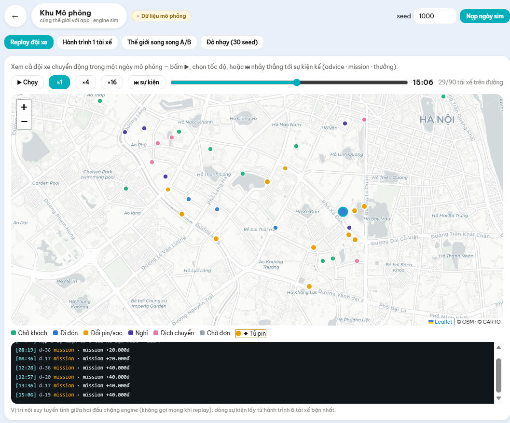 | 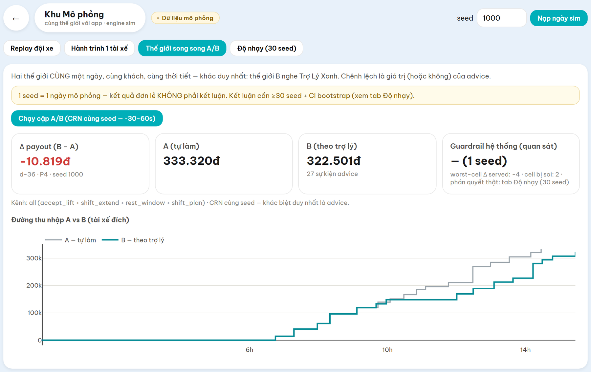 |
| **90 tài xế trong một ngày mô phỏng** — xem được từng người đang chở khách, đi đón, đổi pin hay đang chờ | **So hai thế giới cùng một ngày.** Màn này tự nhắc: một ngày lẻ chưa phải kết luận, cần ít nhất 30 ngày |

| | |
| --- | --- |
| 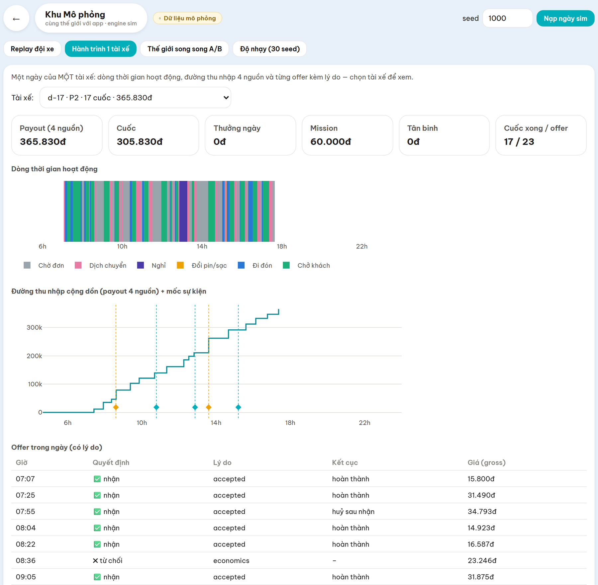 | 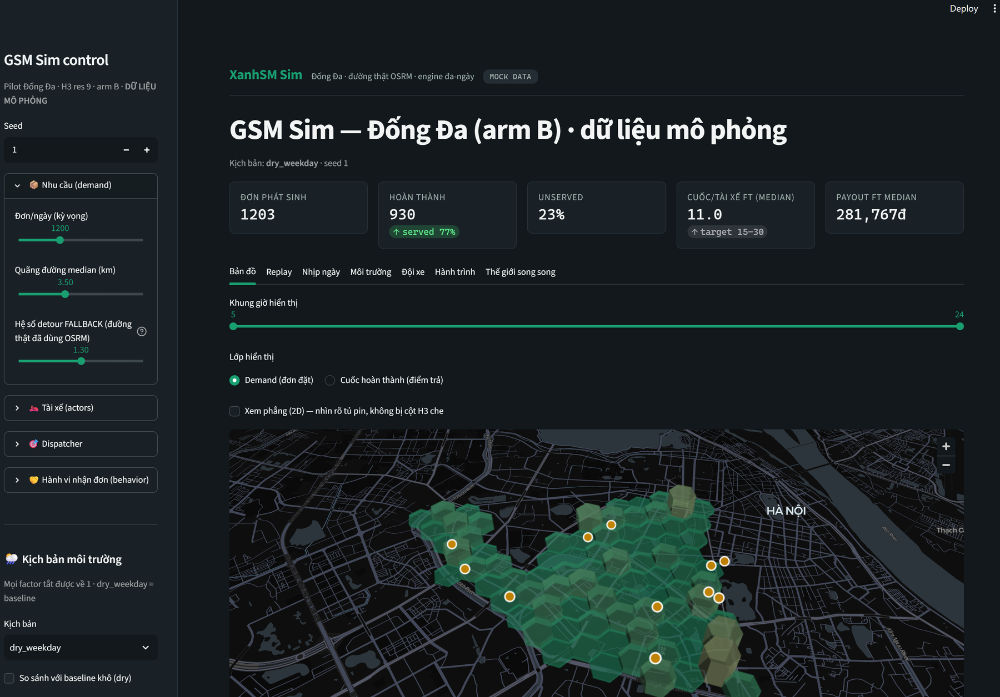 |
| Xem kỹ hành trình một tài xế: chờ ở đâu, đi đón bao xa, nghỉ lúc nào | Bảng theo dõi nội bộ để soi từng mặt: bản đồ, nhịp ngày, môi trường, đội xe |

Mô phỏng cũng là nơi trả lời câu mà thử nghiệm nhỏ **không** trả lời được: *nếu nhiều tài xế cùng
làm theo một gợi ý thì trạm pin và khu vực có chịu được không?*

---

## Kết quả

**Câu hỏi khó nhất:** ngoài đời trợ lý sẽ không bao giờ biết trước khách gọi ở đâu — nó phải tự học
từ những gì quan sát được. Vậy nó còn hữu ích không?

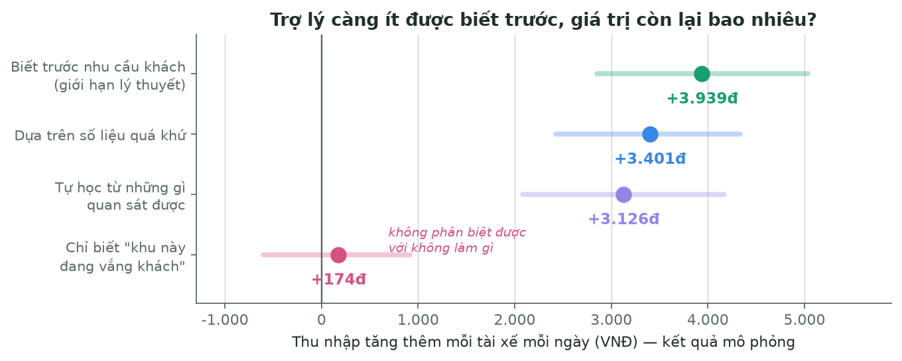

| Trợ lý biết gì | Thu nhập tăng thêm / tài xế / ngày |
| --- | --- |
| Biết trước nhu cầu khách (giới hạn lý thuyết) | **+3.939đ** |
| Dựa trên số liệu quá khứ | **+3.401đ** |
| **Tự học từ những gì quan sát được** — sát thực tế nhất | **+3.126đ** |
| Chỉ dựa vào tín hiệu thô "khu này đang vắng khách" | +174đ — *không phân biệt được với không làm gì* |

**Nghĩa là:** trợ lý **giữ được phần lớn giá trị** khi phải tự học thay vì được cho biết trước.
Nhưng một tín hiệu quá thô thì **vô dụng** — chi tiết này quan trọng, vì nó nói rằng phải đầu tư vào
chất lượng dự báo, không phải chỉ thêm luật.

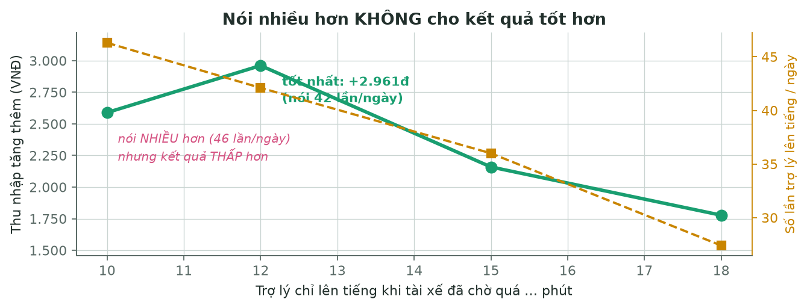

Một kết quả nữa: khi cho trợ lý nói **nhiều hơn**, kết quả lại **kém hơn** — nói 42 lần/ngày tốt
hơn nói 46 lần. Giá trị không đến từ nói nhiều, mà từ **chọn đúng lúc để nói**.

**Cả đội cùng có lợi, không phải giành nhau.** Chênh lệch thu nhập giữa các tài xế **giảm**; không
nhóm tài xế nào bị thiệt; và tỷ lệ khách được phục vụ **tăng dần theo số người dùng** (10% → 25% →
50% → 100% cho mức tăng 0,6 → 1,0 → 1,1 → 1,7 điểm phần trăm). Càng nhiều người dùng thì hệ thống
càng tốt lên.

**Trợ lý không đánh đổi sức khoẻ lấy tiền.** Đo được: tài xế **nghỉ nhiều hơn** và **thời gian làm
việc liên tục giảm**, trong khi thu nhập vẫn tăng. Đây là ràng buộc bọn em đặt ngay từ đầu và kiểm
bằng cơ chế, không phải bằng lời hứa.

> **Lưu ý:** toàn bộ số trên là **kết quả mô phỏng trên dữ liệu giả lập**, không phải hiệu quả đã
> kiểm chứng với tài xế thật. Bọn em cố ý không nói mạnh hơn thế.

---

## Bài học lớn nhất của tuần

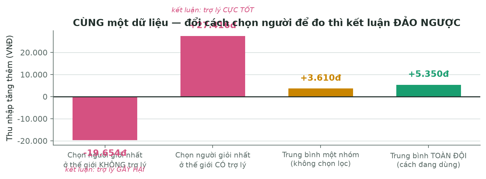

Hình trên là **cùng một dữ liệu, cùng một tính năng** — chỉ khác cách chọn tài xế để đo. Kết quả
chạy từ **−19.654đ** (kết luận: trợ lý gây hại) tới **+27.416đ** (kết luận: trợ lý cực tốt).

Nếu tuần này bọn em không phát hiện ra, rất có thể đã báo cáo một con số đẹp mà sai. Bài học:
**chọn sai cách đo không làm con số lệch một chút — nó đảo ngược cả kết luận.** Từ đó nhóm chuyển
sang đo trên toàn đội thay vì chọn người tiêu biểu.

Một chuyện tương tự xảy ra ngay cuối tuần: sau khi đã có kết quả, nhóm phát hiện **thước đo dùng để
kết luận bị sai**, phải sửa và **đo lại toàn bộ**. Con số cuối **thấp hơn** con số ban đầu, và một
con số cũ thì **không tái lập được nữa**. Nhóm chọn báo con số thấp hơn, vì nó đúng.

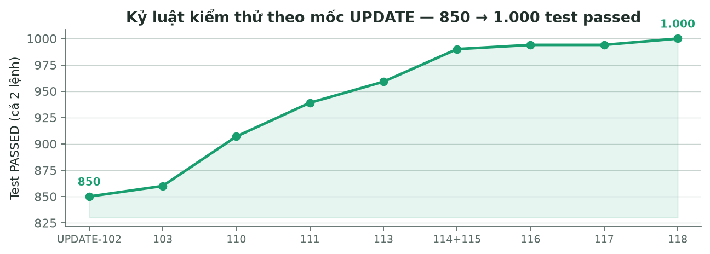

Đi kèm là kỷ luật kiểm thử: **1.000 bài kiểm tra tự động** chạy đúng, tăng từ 850 đầu tuần. Mỗi
thay đổi có ý nghĩa đều phải ghi lại *đã kiểm chứng gì* và — quan trọng hơn — **cái gì chưa kiểm
chứng**. Hiện có **69 mục nợ kỹ thuật còn mở**, mỗi mục có mã và điều kiện mở lại; bọn em trình bày
đây là kỷ luật chứ không phải điểm yếu, vì một vấn đề có mã thì không biến mất trong im lặng.

---

## Tuần 3 sẽ làm gì

- **Cải thiện UI/UX** — tinh chỉnh cách trợ lý xuất hiện và cách trình bày lời khuyên cho dễ hiểu
  hơn.
- **Thu thập thông tin từ các hội nhóm tài xế** để làm giàu dữ kiện và tìm thêm pain point thật —
  những vấn đề tài xế nói với nhau mà báo cáo nội bộ không thấy.
- **Cải thiện mô phỏng và các thuật toán tối ưu hoá** — cả về độ sát thực tế của thế giới mô phỏng
  và chất lượng lời khuyên.
- **Kết nối kết quả tối ưu hoá với phần gọi dữ liệu ngoài** (thời tiết, mật độ giao thông) **rồi
  đưa qua agent để chuẩn hoá đầu ra cho tài xế** — mục tiêu là mọi lời khuyên đến tay tài xế đều
  cùng một giọng, cùng một mức chắc chắn, và luôn kèm lý do.
- **Sửa các chỗ chưa khớp đã ghi nhận trong tuần 2** — trong đó việc đầu tiên là số tầm đi của xe
  hiển thị trên giao diện chưa khớp với phần tính toán bên trong.

---

*Bản kỹ thuật chi tiết kèm theo: **`Week2-Bao-cao-ky-thuat-chi-tiet.pdf`** — đầy đủ phương pháp đo,
thiết kế mô phỏng (số lượng actor/trạng thái/hành động), luồng dữ liệu qua từng trường của schema,
cơ sở nghiên cứu chính sách, guardrails, lựa chọn kiến trúc và nguồn của từng con số.*
