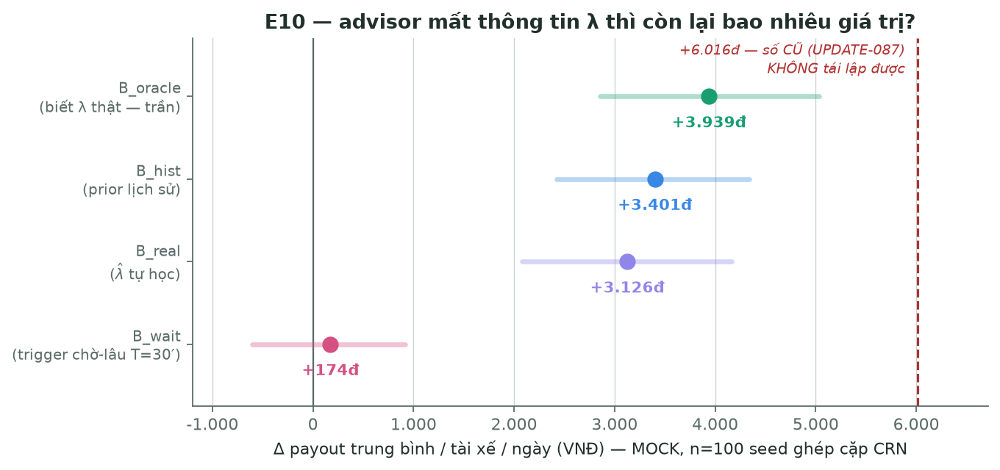
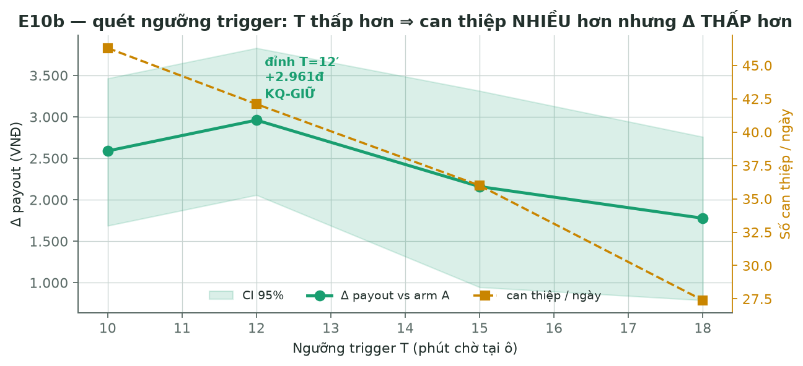
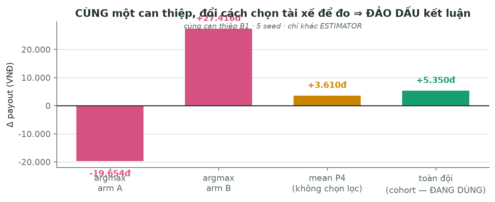
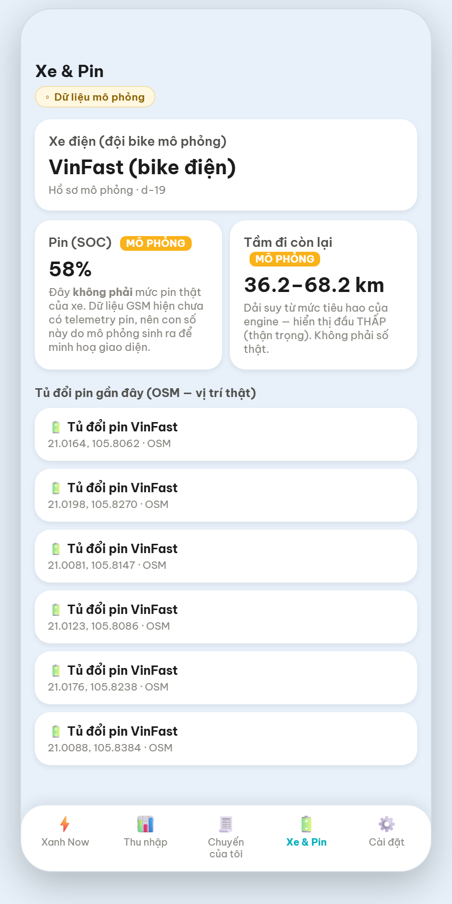
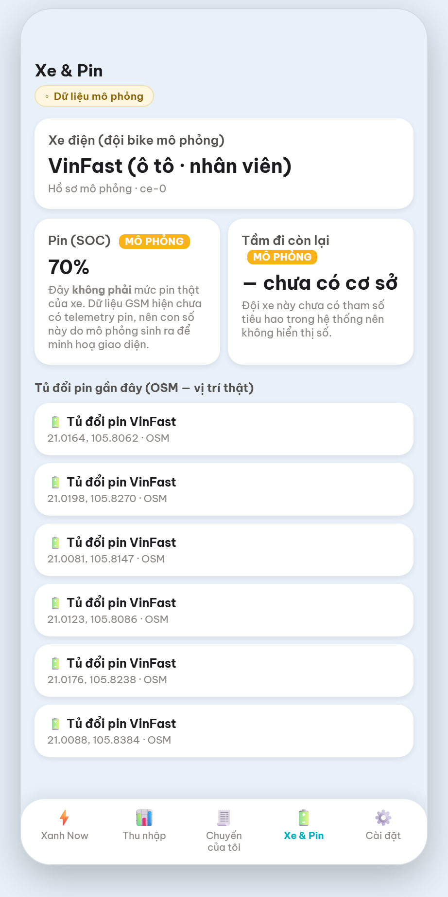

# Week 2 — Báo cáo kỹ thuật chi tiết

### Driver Advisor Team · GSM Driver Income AI Advisor

| | |
| --- | --- |
| **Dự án** | GSM Driver Income AI Advisor — trợ lý hỗ trợ tài xế Xanh SM cải thiện thu nhập |
| **Thành viên** | Trần Quốc Khánh · Lưu Thiện Việt Cường |
| **Kỳ báo cáo** | 23/07/2026 – 01/08/2026 (tuần 2) |
| **Người nhận** | Mentor — bản báo cáo để đánh giá |
| **Ngày phát hành** | 01/08/2026 |

---

## ⚠ Cách đọc mọi con số trong báo cáo này

Đây là điều chúng em muốn nói **trước** mọi kết quả, vì nó quyết định cách đọc toàn bộ phần sau:

1. **Mọi số đo trong báo cáo là số MÔ PHỎNG trên dữ liệu MOCK**, sinh từ generator của nhóm theo
   đúng schema 13 bảng GSM. Không có số nào là hiệu quả đã kiểm chứng trên vận hành GSM thật.
   Script đo tự khai điều này ở dòng đầu (`scripts/measure_e10.py:9`).
2. **Số MOCK / PROXY / ASSUMPTION được gắn nhãn tại chỗ.** Ví dụ: SOC và tầm đi là PROXY
   (13 bảng GSM không có telemetry pin); tỷ lệ nghe lời theo archetype là **giả định hành vi của
   mô hình**, không phải tỷ lệ đo ở người thật.
3. **Trạng thái công việc dùng `DONE-CODE` / `WAITING-VERDICT`, không dùng "DONE".** Quy ước nội
   bộ: chưa được người review thì code xong vẫn không gọi là xong. Hiện có **20 mục đang chờ
   review**.
4. Nhóm **giữ lại cả kết quả xấu** (kể cả Δ âm) trong báo cáo, vì chúng là bằng chứng cho phương
   pháp đo — xem §11.6 và §12.

---

## 1. Mục tiêu tuần 2 và trạng thái thực tế

| # | Mục tiêu đặt ra | Trạng thái | Bằng chứng |
| --- | --- | --- | --- |
| M1 | Trả lời được câu hỏi trung tâm: **advisor mất thông tin cầu (λ) thì còn lại bao nhiêu giá trị?** | ✅ **Đo xong** 5 arm, n=100 | §11.1 |
| M2 | Dựng **hạ tầng đo tin được**: ghép cặp CRN, bootstrap CI, cổng thống kê chặn kết luận sai | ✅ **Đo xong**, cổng đã bắn thật | §11.3, §4.3 |
| M3 | **Guardrail sức khoẻ + hệ thống** để advisor không tối ưu tiền bằng cách hại tài xế/hệ thống | ✅ `DONE-CODE` — nối nguồn 01/08 | §11.4, §7.4 |
| M4 | **Chuẩn hoá đường dữ liệu theo schema thật**: 13 bảng → view L3 → solver | ✅ **Xong** — view + kiểm thử theo đúng schema GSM; sản phẩm chạy trên **dữ liệu mô phỏng** theo đúng phạm vi được phép | §6.4 |
| M5 | **Sản phẩm demo được**: app tài xế + khu mô phỏng | ✅ Chạy được, `WAITING-VERDICT` | §9 |

Ngoài 5 mục tiêu trên, tuần 2 phát sinh **một nhánh công việc không lên kế hoạch trước** và nó
chiếm phần lớn hai ngày cuối: sau khi hoàn tất M1, nhóm phát hiện **thước đo dùng để kết luận M1
bị sai**, phải sửa thước và **đo lại toàn bộ** (§12.2). Đây là phần chúng em cho là đáng báo cáo
nhất, dù nó làm con số headline **giảm xuống**.

---

## 2. Hướng xây dựng sản phẩm

### 2.1 Bài toán

Thu nhập một ca không chỉ phụ thuộc số cuốc. Trong một ca, tài xế đồng thời phải cân: thời gian
còn lại · cầu dự kiến theo từng khung giờ · trạng thái pin và thời gian đổi/sạc · mốc điểm thưởng
đang theo · thời gian chờ · và ảnh hưởng của một lựa chọn lên kết quả cuối ca. Đây là **bài toán
tối ưu đa biến có ràng buộc**, nhưng tài xế phải giải nó trên đường, trong vài giây.

Sản phẩm định vị là **trợ lý hỗ trợ quyết định**: đưa phương án + lý do + điều kiện, rồi để tài xế
tự quyết. Không phải chatbot trả lời chung.

### 2.2 Ba thời điểm có giá trị

| Thời điểm | Câu hỏi của tài xế | Sản phẩm cung cấp |
| --- | --- | --- |
| **Trước ca** | Đặt mục tiêu gì, phân bổ thời gian thế nào? | Kế hoạch ca + khoảng cách tới mốc thưởng |
| **Trong ca** | Nên chạy tiếp, đứng chờ, chuyển vùng, nghỉ hay đi sạc? | Phương án theo trạng thái hiện tại + dự báo cầu |
| **Sau ca** | Vì sao ca chưa đạt kỳ vọng? | Phân tích thời gian chờ, cuốc, điểm, mẫu hành vi |

### 2.3 Ranh giới — điều sản phẩm KHÔNG làm

Đây là **ràng buộc cứng**, được thi hành bằng cơ chế trong code (§7), không phải bằng lời hứa:

- **Không** tự nhận / từ chối / huỷ một cuốc cụ thể;
- **Không** thay thế hay can thiệp dispatch · matching · pricing · routing của GSM — advisor chạy
  **trên nền** các thuật toán đó (chứng minh: `src/gsm_sim/dispatcher.py` **151 dòng, 0 lần** tham
  chiếu `advice|advisor|bridge`);
- **Không** hứa chắc mức thu nhập; mọi phát biểu kèm bất định và điều kiện;
- **Không** để LLM tự sinh số tài chính — mọi số hiển thị đến từ solver kiểm chứng được (§7.2);
- **Không** coi sức khoẻ là biến để tối ưu, tức không đánh đổi sức khoẻ lấy tiền (§7.4);
- **Không** trình bày số mô phỏng như số thật của GSM.

---

## 2b. Finding facts — cơ sở thực tế để dựng mô phỏng

Mô phỏng chỉ có giá trị nếu tham số của nó đến từ thực tế. Trước khi viết engine, nhóm nghiên cứu
chính sách và cấu trúc chi phí thật của GSM, và **gắn nhãn độ tin cậy cho từng con số** —
`REAL` (từ nguồn official có URL, đã fetch), `PROXY` (suy từ nguồn gián tiếp), `ASSUMPTION`
(nhóm tự đặt, chưa có nguồn).

### 2b.1 Chính sách thu nhập — nền của mọi phép tính tiền

| Nội dung | Số thật | Nhãn |
| --- | --- | --- |
| Chia sẻ doanh số Bike | **"lên tới 75%"**, hiệu lực 02/03/2026 | `REAL` — greensm.com |
| Mốc điểm → thưởng tuần, Khu vực 1 (HN/HCM/ĐN/BD) | 400–699đ: **200k** · 700–1.099đ: **400k** · 1.100–1.399đ: **800k** · ≥1.400đ: mốc cao nhất | `REAL` |
| Điểm mỗi cuốc (snapshot 07/2025 — **sim đang dùng**) | cao điểm 6–8h & 16–18h: **10 điểm** · giờ thường: **5 điểm** | `REAL` (snapshot) |
| Điều kiện thưởng tuần | ≥5 ngày hoạt động/tuần + nhận ≥85% + hoàn thành ≥85%; bản mới thêm **điểm sao > 4,85** | `REAL` |
| Khoán tuần — truy thu khi không đạt | **20%** phần doanh số chưa đạt (toàn quốc), **tới 40%** ở HN/HCM | `REAL` |
| **Bỏ phạt tỷ lệ nhận/hoàn thành** (23/02/2026) | *"Không áp dụng hình thức xử phạt khi tỷ lệ nhận chuyến và tỷ lệ hoàn thành thấp"* | `REAL` |
| Đảm bảo thu nhập 3 tháng đầu | HN/HCM: full-time **tới 600.000đ/ngày**, part-time tối thiểu **360.000đ/ngày** | `REAL` |
| Thưởng thâm niên | 6–9 tháng: **500k/tháng** · 9–12 tháng: **700k** · ≥12 tháng: **1tr** | `REAL` |

**Một phát hiện làm đổi hướng thiết kế:** chính sách 23/02/2026 **bỏ hình thức phạt** theo tỷ lệ
nhận/hoàn thành và chuyển sang **khoán tuần + truy thu**. Nghĩa là cấu trúc động lực của tài xế đã
dịch từ *"tránh bị phạt"* sang *"đạt khoán"*. Nghiên cứu ban đầu của nhóm (dựa trên bản cũ) đã lỗi
thời và phải cập nhật lại toàn bộ — đây là lý do trong repo có một vòng "research refresh" riêng.

### 2b.2 Cấu trúc chi phí — vì sao mô phỏng phải mô hình pin nghiêm túc

| Nội dung | Số thật | Nhãn |
| --- | --- | --- |
| Đổi pin tại trạm công cộng | **9.000đ/lượt** | `REAL` |
| Miễn phí đổi pin cho tài xế Platform độc quyền | **không giới hạn, tới 31/03/2029** | `REAL` |
| Thuê pin sau ưu đãi | **175.000đ/tháng** (1 pin) · **300.000đ/tháng** (2 pin) | `REAL` |
| Dung lượng pin | pack đổi LFP **1,5 kWh** · Feliz S / Evo200 **3,5 kWh** LFP | `REAL` |
| Sạc tại nhà | ~**70–93đ/km**; sau ưu đãi ~**150đ/km** | `PROXY` |

Vì phí đổi pin đang **miễn phí tới 2029**, mô hình chi phí mặc định đặt `swap_fee = 0` — nhưng
tham số vẫn để mở để quét được khi ưu đãi kết thúc. Đây là ví dụ cho nguyên tắc: **số có thể đổi
thì phải là tham số, không phải hằng số chôn trong code**.

### 2b.3 Những gì nhóm CHƯA có nguồn — khai thẳng

| Thiếu | Hệ quả |
| --- | --- |
| **Dữ liệu về mệt và tai nạn** | Không thể định giá "gợi ý nghỉ đáng bao nhiêu tiền" ⇒ nhóm **từ chối** đưa ra con số đó (§12.4) |
| **Telemetry pin trong 13 bảng GSM** | SOC và tầm đi phải dùng `PROXY` tất định, không phải số đo |
| **Tỷ lệ nghe lời của tài xế thật** | Tỷ lệ trong mô phỏng là `ASSUMPTION` — dùng để quét độ nhạy, không phải để dự báo |
| **4/13 bảng chưa có danh sách cột** (gồm `trips`) | Chưa verify được schema khớp GSM ⇒ 4 test đang skip (§11.5) |
| Trần ca 12h/ngày | `ASSUMPTION` — không có cửa sổ ca khai báo trong bảng thật |

Nhóm chủ trương: **thiếu thì nói thiếu**. Một khoảng trống được khai báo an toàn hơn một con số
được điền cho đủ bảng.

---

## 3. Định hướng từng feature

Advisor có **5 kênh** can thiệp. Điều đáng nói là trạng thái bật/tắt của chúng **do kết quả đo
quyết định**, không do ý muốn:

| Kênh | Làm gì | Trạng thái | Vì sao |
| --- | --- | --- | --- |
| `positioning_overrides` | Khi bản năng tài xế là *đứng chờ*, gợi ý chuyển sang ô có cầu cao hơn | ✅ **BẬT** (`wait_only`) | Kênh **duy nhất** được duyệt: đo ra dương và bền qua nhiều vòng |
| `shift_plan` | Lập lịch ca (chạy/nghỉ/sạc) | ❌ **TẮT** | Đo ra **có hại** — quyết định ĐA-07 |
| `accept_lift` | Nâng nhẹ xu hướng nhận cuốc (`step 0,10`, trần `0,15`) | ❌ **TẮT** | Đo ra không hiệu quả |
| `shift_extend` | Gợi ý kéo dài ca | ❌ **TẮT** | Đo ra không hiệu quả |
| `rest_window` | Gợi ý khung nghỉ | ❌ **TẮT** | Trong A/B một-ngày kênh này **nói 0/873 lần** — cần chế độ nhiều ngày mới đo được (§12.4) |

**Nguyên tắc rút ra:** *"không hiệu quả thì TẮT để advisor im lặng"*. Một trợ lý nói ít mà đúng
tốt hơn một trợ lý nói nhiều. Đây cũng là lý do §9.2 thiết kế "card im lặng".

---

## 4. Công nghệ và toán ứng dụng

### 4.1 Chín solver — phát biểu toán học

Đây là **quy tắc thiết kế**: mọi con số tài chính hiển thị cho tài xế **phải** đi qua một trong
chín solver này — solver là code thuần, tất định, có test, **không phải LLM**.

⚠ **Trạng thái thi công thì khác quy tắc, và chúng tôi nói thẳng ở cột cuối.** Ở bản build hiện
tại, **5/9 solver chưa có lời gọi `.solve()` nào** ngoài chính test của nó; đường sản phẩm thực
sự chạy **S1** (và **S2** khi có đủ runtime state). Bảng dưới đây đếm bằng lệnh, không bằng trí
nhớ — cột *Trạng thái* là số lời gọi `.solve()` ngoài package `solvers/`.

| Solver | Bài toán | Phương pháp | Trạng thái |
| --- | --- | --- | --- |
| **S1** `bonus_feasibility` | Còn *h* giờ và *p* điểm hiện tại, có kịp mốc thưởng kế tiếp không? Cần thêm bao nhiêu cuốc/giờ? | Đại số đóng trên tốc độ điểm/giờ theo khung giờ + kiểm khả thi so quỹ giờ | ✅ **chạy ở SẢN PHẨM** + sim |
| **S2** `shift_dp` | Phân bổ các khoảng `ONLINE / REST / SWAP / END` trong thời gian còn lại | **Dynamic programming** trên trạng thái (thời gian còn lại, SOC, điểm, nợ nghỉ) | ⚠ **đã đi dây ở sản phẩm** nhưng bị chặn bởi thiếu runtime state; kênh sim **TẮT** theo ĐA-07 |
| **S3** `f3_patterns` | Ca vừa rồi có mẫu hành vi nào làm giảm hiệu quả? | Thống kê mô tả trên chuỗi phân đoạn | ❌ **0 lời gọi** |
| **S4** `capacity_alloc` | Nếu **nhiều** tài xế cùng nhận một gợi ý thì trạm/khu có chịu được không? | **Linear assignment** (`scipy.optimize.linear_sum_assignment`) chống dồn cục | ✅ chạy trong **sim** (kênh vị trí — kênh duy nhất bật mặc định) |
| **S5** `weekly_khoan` | Khoán tuần: còn thiếu bao nhiêu, có khả thi không? | Đại số + kiểm ràng buộc, tách gross/payout | ❌ **0 lời gọi** · ⚠ **chưa kiểm chứng được**: sim không mô hình hoá khoán tuần/clawback |
| **S6** `mission_knapsack` | Chọn tổ hợp nhiệm vụ nào trong quỹ thời gian còn lại? | **0/1 knapsack** (reward vs effort, capacity = giờ còn) | ❌ **0 lời gọi** |
| **S7** `idle_reduction` | Khoảng chờ dài nào đáng chuyển thành di chuyển/nghỉ? | Phát hiện đoạn + so sánh chi phí cơ hội theo cầu giờ | ✅ chạy trong **sim** (kênh `rest_window`, hiện TẮT) |
| **S8** `penalty_explain` | Khoản trừ đến từ đâu, ngưỡng chính sách nào? | Tra cứu bảng ngưỡng trong input; **không** nhận `PolicyBundle` (`solve(pi)`), và nhãn nguồn `policy_v:threshold` **chưa mang số version** | ❌ **0 lời gọi** · ⚠ **ngoài scope**: luồng giải trình vi phạm thuộc **dự án khác** |
| **S9** `anomaly_alert` | Chỉ số nào lệch bất thường so với chính tài xế đó? | So sánh với phân phối lịch sử cá nhân | ❌ **0 lời gọi** |

Mỗi solver trả về một **`SolverReport`** gồm: `problem_digest` (phát biểu bài toán), *numbers with
source* (mỗi số kèm nguồn), `sensitivity`, và `infeasible_reason` khi bài toán không khả thi.
Trường "nguồn cho từng số" chính là thứ khiến tầng agent **không thể** bịa số (§7.2).

### 4.2 Điều phối cuốc trong mô phỏng — hai tầng

Đây là cơ chế tạo ra "thế giới vận hành" để đánh giá advisor. **Không phải** tính năng cho advisor
điều khiển hệ thống GSM.

**Tầng 1 — thu hẹp ứng viên bằng H3.** Với mỗi đơn, chỉ xét tài xế trong `grid_disk(pickup_cell,
k_max)` ở **H3 resolution 9** (lưới vận hành ~**85 ô lõi**; resolution 8 dùng để tổng hợp
heatmap). Điều này giảm số cặp phải tính và phản ánh thực tế: không phải mọi tài xế trong thành
phố đều là ứng viên cho một đơn.

**Tầng 2 — ghép cặp theo lô, tối ưu tổng ETA.** Các cặp (đơn, tài xế) khả thi vào một ma trận chi
phí với `cost = ETA_pickup`; cặp không khả thi gán `INFEASIBLE = 1e6`; giải bằng
**`linear_sum_assignment`** (thuật toán Hungarian), chỉ nhận cặp có `ETA ≤ eta_max_min`, mỗi tài
xế tối đa 1 đơn/tick.

Vì sao không dùng greedy: greedy có thể chọn tài xế gần theo đường chim bay nhưng ETA thực tế xấu
hơn, và xử lý đơn theo `order_id` làm đơn tới sau mất ứng viên khả thi duy nhất. Greedy **vẫn được
giữ** làm baseline đối chiếu và làm đường lui khi `n_orders × n_drivers > 200.000` cặp.

**ETA** tính bằng haversine giữa toạ độ liên tục thật của tài xế và điểm đón, **nhân hệ số đường
thật theo cặp ô** từ ma trận **OSRM** cache offline — không dùng hệ số phẳng, vì hệ số OSRM thật
biến thiên **1,00 → 3,50** (dùng hệ số phẳng từng làm **293/3.520 lượt bị bỏ oan**).

### 4.3 Phương pháp thống kê — phần quyết định độ tin của mọi kết luận

**(a) Ghép cặp CRN (common random numbers).** Trace ngoại sinh (đơn hàng, thời tiết) được sinh
**trước** khi chạy, tất định theo seed, và **dùng chung cho cả hai arm**. Hai thế giới chỉ khác
đúng một điều: arm B nghe advisor. Nhờ vậy Δ per-seed loại được phương sai ngoại sinh —
`Δ_X(s) = B_X(s) − A(s)`, và so arm-vs-arm là **hiệu của hiệu** trên từng seed.

**(b) Bootstrap CI theo cặp.** `n_boot = 5000`, `alpha = 0,05`, `seed = 12345` — resample **theo
seed** (đơn vị độc lập), không theo tài xế hay theo ngày, vì tài xế trong cùng một run không độc
lập với nhau.

**(c) Ngưỡng cỡ mẫu được mã hoá trong code, không tuỳ ý:**
`MIN_SEEDS_FOR_SIGNIFICANCE = 30` cho so A/B thường; `MIN_SEEDS_FOR_VARIANT_COMPARISON = 100` cho
so **hai biến thể advice** (bài toán khó hơn, cần cỡ mẫu lớn hơn). Kèm **MDE** báo cùng mỗi Δ:
MDE cho biết ta chỉ loại trừ được suy giảm *lớn hơn* mức đó — không phải "suy giảm bằng 0".

**(d) Cổng thống kê Poisson-binomial cho tỷ lệ nghe lời.** Mỗi lần advisor nói, việc tài xế nghe
hay không là một Bernoulli với xác suất riêng theo archetype ⇒ tổng số lần nghe theo
**Poisson-binomial**. Cổng tính

<div class="formula">z = (S − Σpᵢ) / √(Σpᵢ(1−pᵢ))</div>

với `pᵢ` lấy từ **tỷ lệ danh nghĩa của chính run đó** (không hard-code), và **TREO kết luận khi
|z| > 4,0** (`ADHERENCE_Z_MAX = 4.0`), kèm ngưỡng mẫu số tối thiểu `20` để không phán trên mẫu quá
nhỏ. Cổng này đã **thực sự bắn** và chặn một kết luận sai — §11.3.

**(e) Ước lượng không thiên lệch cho tiêu chí cá nhân.** Dùng **cohort estimator** (trung bình
trên *mọi* tài xế, tách theo archetype), **không** dùng argmax. Lý do ở §11.6 — đây là bài học đắt
nhất của nhóm.

**(f) Công bằng và tập trung.** **Gini** trên phân phối payout (bất bình đẳng thu nhập giữa tài
xế) và **HHI** (Herfindahl–Hirschman Index) cho mức dồn cục ở trạm pin và ở ô cung.

---

## 4b. Architecture choice — bốn quyết định và lý do

Bốn quyết định kiến trúc dưới đây định hình toàn bộ dự án. Nhóm ghi cả **phương án đã bị loại** để
mentor thấy đây là chọn lựa có cân nhắc, không phải mặc định.

### 4b.1 Tách "tính" khỏi "nói" — thay vì để LLM làm cả hai

**Chọn:** solver tính → agent diễn giải → verifier kiểm bằng code → card.
**Đã loại:** để LLM đọc dữ liệu thô rồi tự đưa ra khuyến nghị kèm số.

**Lý do:** sản phẩm nói về tiền của người khác. Một con số sai không chỉ là bug — nó là lời khuyên
sai về thu nhập. Kiến trúc này làm việc bịa số **bất khả về mặt cấu trúc**, chứ không phụ thuộc
việc prompt có tốt hay không: agent chỉ nhận được `SolverReport`, và mỗi số trong đó đã mang nguồn.
Đổi lại, nhóm mất khả năng trả lời những câu hỏi mở mà solver chưa phủ — chấp nhận được ở giai đoạn
này.

### 4b.2 Top-down (flow-first) — thay vì mô hình hoá từ đầu

**Chọn:** dựng luồng sản phẩm trước, mỗi bước gọi một solver độc lập.
**Đã loại:** dựng một bài toán tối ưu tổng thể từ các biến nguyên tử rồi giải một lần.

**Lý do:** bài toán thật *là* một bài tối ưu đa biến có ràng buộc, nhưng nếu mô hình hoá toàn bộ
ngay từ đầu thì (a) chưa có dữ liệu thật để hiệu chuẩn, và (b) không ship được gì cho tới khi mô
hình hoàn chỉnh. Cách top-down cho phép **từng kênh được đo và tắt/bật độc lập** — chính vì thế
tuần này nhóm mới tắt được 4/5 kênh dựa trên số đo (§3) thay vì phải giữ cả khối.

### 4b.3 Mô phỏng ghép cặp — thay vì thử trực tiếp hoặc A/B trên người

**Chọn:** hai thế giới cùng seed, khác đúng một biến.
**Đã loại:** thử nghiệm trên tài xế thật ở giai đoạn này.

**Lý do:** không thể (và không nên) đem một trợ lý chưa kiểm chứng vào thu nhập thật của người
khác. Mô phỏng ghép cặp cho phép trả lời *"nếu nhiều người cùng làm theo thì sao"* — câu hỏi mà
A/B trên người **không** trả lời được nếu nhóm thử nghiệm quá nhỏ. Giá phải trả: mọi kết luận chỉ
đúng trong phạm vi mô hình, nên báo cáo này gắn nhãn MOCK ở mọi bảng số.

### 4b.4 Phân tầng dữ liệu `L1` / `L1R` — thay vì một tầng chung

**Chọn:** tách rõ dẫn xuất-từ-sim (`L1`) và dẫn xuất-từ-bảng-thật (`L1R`), gặp nhau ở tầng view
`L3` mà solver đọc.
**Đã loại:** một tầng dữ liệu chung cho cả hai nguồn.

**Lý do:** bảng thật GSM **đã có** field đo được (`acceptance_rate`, `online_time`, `commission`);
tự đếm lại từ event là tạo ra nguồn sự thật thứ hai — và nhóm đã trả giá cho việc đó bằng một lỗi
`online_time = 0`. Nhờ tách tầng, solver **không cần biết** dữ liệu đến từ sim hay từ bảng thật;
đó cũng là điều kiện để sau này thay nguồn mà không sửa solver.

---

## 5. Thiết kế mô phỏng (simulator)

### 5.1 Vì sao cần mô phỏng

Không thể thử advisor trực tiếp trên vận hành GSM thật. Mô phỏng là **môi trường thí nghiệm có
kiểm soát** để trả lời bốn câu hỏi không thể hỏi bằng cách khác: bật/tắt advice thì cùng một tình
huống đổi thế nào · một phương án có lợi cho một tài xế có gây hại cho người khác không · khi nhiều
người cùng nhận một gợi ý thì capacity và số đơn hết hạn ra sao · kết luận có bền qua nhiều seed
không.

### 5.2 Kiến trúc engine

Discrete-event simulation trên **SimPy**. Mỗi tài xế là một process; cộng các process nền:
dispatcher, quét đơn hết hạn, planner vị trí (khi bật kênh), probe thống kê. Kết thúc bằng
`env.run(until=end_min)` rồi chốt sổ và **censor đơn còn treo** (ghi `CENSORED_END_OF_RUN` hoặc
`EXPIRED`, không bỏ im lặng).

### 5.3 Actor: số lượng, trạng thái, hành động

**90 tài xế**, lấy mẫu từ **bảy archetype** `P1…P7`. Số lượng mỗi loại tính bằng
`round(n × tỷ trọng)` rồi hiệu chỉnh cho đủ tổng — **không dùng RNG**, nên cố định với mọi seed.
(P6 "ca sáng sớm" và P7 "ca tối-đêm" được thêm để phủ khung 05–06h và 21–23h.)

**Trạng thái** — enum `ActorState` **6 giá trị**: `OFFLINE` · `IDLE` · `ENROUTE` (đang tới điểm
đón) · `ON_TRIP` · `CHARGING` · `REST`. Đội xe chia hai loại `FleetType`: **SWAP** (đổi pin tại
trạm) và **CHARGE** (sạc tại nhà).

Ngoài enum, mỗi actor mang một khối trạng thái chia 4 nhóm: (1) tham số bất biến trong ngày
(archetype, fleet, ô nhà, giờ vào/ra ca, sai số kinh nghiệm cá nhân, ngưỡng mệt, giờ ăn);
(2) trạng thái động (state, ô, toạ độ, SOC, ô đang tới, giờ nghỉ đã lên kế hoạch); (3) bộ đếm
ngày (cuốc, đơn được chào/nhận/hoàn thành/huỷ/bỏ vì SOC, gross, payout, điểm, số lần mắc kẹt,
rating…); (4) đồng hồ thời gian (online, rỗng, có khách, chờ, nghỉ, sạc, **chuỗi chờ liên tục**,
nợ nghỉ, thời gian đã kéo ca…).

**Hành động khi rỗi** — enum `IdleAction` **6 giá trị**, chọn theo thứ tự ưu tiên:

1. `GO_SWAP` / `GO_CHARGE` — SOC ≤ ngưỡng (ưu tiên cao nhất);
2. `END_SHIFT` — quá giờ tan ca;
3. `REST` — đúng giờ ăn **và** mệt > 0,35 **và** coin 0,5 (tối đa 1 lần/ngày);
4. `REST` — mệt > 1,0 **và** coin 0,3;
5. `RELOCATE` — so sánh kỳ vọng cầu ô lân cận với ô hiện tại;
6. `WAIT` — mặc định.

### 5.4 Cách chọn tối ưu — và chỗ mô hình cố ý *không* tối ưu

Điểm thiết kế quan trọng: **tài xế trong mô phỏng không phải người tối ưu hoàn hảo.** Nếu họ tối
ưu hoàn hảo thì advisor không thể có giá trị, và mô hình sẽ không nói được gì về thực tế.

- **Quyết định nhận cuốc** là một mô hình logit:
  `x = logit(accept_base) + w · z`, với `z = (net − center)/scale` **kẹp trong [−2, 2]** và
  `net = gross − pickup_km × pickup_disutility`. Tiêu **đúng một** lần `rng.random()` để không
  làm lệch chuỗi ngẫu nhiên — đây là điều kiện để CRN còn đúng.
- **Kinh nghiệm cầu là sai lệch có chủ ý:** mỗi archetype có `demand_prior_sigma` riêng, nên tài
  xế nhìn cầu **qua một lớp nhiễu cá nhân**, trong khi thế giới có λ thật. Khoảng trống giữa hai
  cái đó chính là **dư địa của advisor** — và §11.1 đo đúng khoảng trống này.
- **"Sốt ruột" là bản năng, không phải lời khuyên:** khi chuỗi chờ dài ra, tài xế tự nới bán kính
  tìm kiếm và hạ tiêu chuẩn kén chọn; tới hạn thì bỏ hẳn phép so sánh và đi tới ô lân cận tốt
  nhất. Cơ chế này **được gắn nhãn bản năng** để không bị tính nhầm thành công của advisor.

### 5.5 Tham số thế giới đang chạy

| Tham số | Giá trị | Ghi chú |
| --- | --- | --- |
| Cửa sổ chạy | 05:00 – 24:00, **warm-up 60′** | Metrics tính từ 06:00 |
| Đơn/ngày | **1.200** (kỳ vọng trong cửa sổ) | Hình dạng theo giờ được chuẩn hoá lại |
| Lưới không gian | **H3 res 9** (~85 ô lõi), res 8 để tổng hợp | Đống Đa, Hà Nội |
| Nhịp thời gian | **5 nhịp khác nhau**: dispatch 5s · quét hết hạn 0,5′ · actor chờ 2,0′ · actor bận 1,0′ · planner 60′ | Không phải một tick duy nhất |
| Tiêu hao pin | swap **1,6 %/km** · charge **0,85 %/km** | ⇒ tầm ở SOC 100%: **62,5 km** / **117,6 km** |
| Sạc tại nhà | **210′**, SOC → 100 | Phải *về nhà* (tốn thời gian + pin thật) |
| Trạm đổi pin | tủ có **tồn kho pin**, sạc lại **105′**/viên, chờ tối đa **60′** | Đổi 1–1 **atomic** để tổng pin bất biến, chống hai tài xế giành một viên |
| Cổng SOC trước khi chào đơn | `soc − total_km × pct_per_km > 8,0` | Không đủ thì đếm riêng `orders_soc_skipped`, **không** tính là "huỷ" |

Toàn bộ số trên đọc từ `configs/pilot_dongda.yaml` — **một nguồn cấu hình duy nhất** cho mọi phép
đo (xem §12.3 về việc nhóm vừa xoá ba tham số dẫn xuất khỏi file này).

---

## 6. Luồng dữ liệu qua schema

### 6.1 Kiến trúc phân tầng

```
L0  nguồn thô (event / bảng)
L1  dẫn xuất từ sim          L1R  dẫn xuất từ 13 BẢNG THẬT của GSM
L2  tổng hợp                 L2I  tổng hợp phía inference
L3  VIEW đầu vào cho solver  ──►  solver (S1…S9)  ──►  SolverReport  ──►  card
```

Tách `L1` (sim) và `L1R` (bảng thật) là quyết định kiến trúc có chủ ý: bảng thật GSM **đã có field
đo được** (`acceptance_rate`, `fulfillment_rate`, `online_time`, `total_fee`/`commission`), nên
phải **đọc thẳng**, không tự đếm lại từ event — chính việc recompute từng là nguồn của một lỗi
`online_time = 0`.

### 6.2 Ví dụ cụ thể: view cho S1 đọc field nào

`bonus_gap_input` (đầu vào của S1 BonusFeasibility):

| Field của view | Nguồn | Ghi chú |
| --- | --- | --- |
| `acceptance_rate`, `completion_rate` | **đọc thẳng** `driver_statistic_daily` | Nếu hôm nay chưa có dòng đo → carry-forward giá trị đo gần nhất và **hạ nhãn xuống `ESTIMATED`**, không bịa 1,0 lạc quan |
| `points_now` | **tính** từ `trips` × `PolicyBundle` | Điểm không có trong bảng thật; chỉ cộng cuốc có `complete_time ≤ t_now` |
| `hours_budget_remaining` | `driver_online_hours_sap_id` hoặc cửa sổ ca khai báo | Trần ca 12h là ASSUMPTION |
| `historical_points_per_hour` | `trips` các ngày **trước** hôm nay | Chỉ lấy khi có ≥ 3 ngày |
| `next_tiers` | `PolicyBundle` (có version) | Mốc thưởng theo chính sách đã lưu |
| `soc_pct` | **`None`** | 13 bảng GSM **không có** telemetry pin — khai thẳng là thiếu |

### 6.3 Dữ liệu mock sinh theo schema

Generator sinh dữ liệu **đúng theo schema 13 bảng**, tất định theo seed, và ở chế độ mặc định các
ngày là **một chuỗi liên tục** (cùng nhóm tài xế, trạng thái mang sang) thay vì các ngày rời rạc —
để đo được hiệu ứng liên-ngày như "học từ hôm qua".

### 6.4 Trạng thái thật của luồng này

| Luồng | Trạng thái |
| --- | --- |
| **mô phỏng → solver → agent → UI** | **Kín, chạy được** — kiểm end-to-end 01/08: 4/4 endpoint trả HTTP 200 kèm nhãn `data_mode`/`is_mock` |
| **schema 13 bảng → view L3 → solver** | **Đã viết và có kiểm thử** theo đúng schema thật; sản phẩm chạy trên **dữ liệu mô phỏng sinh theo chính schema đó** |

Đây là **lựa chọn về phạm vi, không phải thiếu sót**: GSM cấp *cấu trúc* 13 bảng, còn dữ liệu vận
hành thật thì nhóm không truy cập. Nên nhóm dựng đường đọc dữ liệu **đúng theo schema** rồi chạy
trên dữ liệu mô phỏng sinh cùng schema — nhờ vậy solver không cần biết dữ liệu đến từ đâu, và khi
có quyền truy cập thật thì thay nguồn mà không phải sửa solver (§4b.4).

Hệ quả cần nhớ khi đọc báo cáo: **mọi số trong §11 là số mô phỏng** — điều này đã nêu ở đầu tài liệu.

---

## 7. Agent được dùng ở đâu, và guardrails

### 7.1 Ranh giới: agent giải thích, solver tính

```
Dữ liệu + bối cảnh  →  Solver / analytics  →  SolverReport (số + NGUỒN từng số)
                                                      │
                                                      ▼
                          Agent: diễn giải · so sánh · nêu lý do · nêu caveat
                                                      │
                                                      ▼
                            Verifier (kiểm 3 tầng, CODE veto)  →  Card cho tài xế
                                                      │
                                                      ▼
                                     Tài xế tự quyết định  →  ghi nhận kết cục
```

Agent **không** thực hiện phép tối ưu và **không** sinh số tài chính. Nó nhận kết quả đã tính rồi
chuyển thành ngôn ngữ tài xế dùng được. Cách này giữ hai yêu cầu cùng lúc: sản phẩm có giao tiếp
tự nhiên, mà các con số vẫn đến từ thành phần kiểm chứng được.

### 7.2 Điều này được **thi hành** thế nào, không chỉ là nguyên tắc

Adapter phục vụ UI (`ui/backend/app/adapters/advisor.py`) dựng `bonus_gap_input` từ bảng rồi **gọi
solver S1 thật** (`gsm_core.solvers.bonus_feasibility.solve()`); nó chỉ *dịch* `SolverReport` sang
contract của card. Mỗi số trong card mang field `source`. Trong code còn một chốt tường minh: khi
một đại lượng không có nguồn chắc chắn thì **để danh sách `numbers` rỗng** kèm ghi chú *"hiển thị
nó ở đây sẽ thành lời hứa"* — tức thà nói ít hơn là nói một con số không truy được.

### 7.3 Pipeline Router → Composer → Verifier

**Router** (zero-ML, luật) chọn chủ đề và solver. **Composer** dựng câu trả lời theo hướng
placeholder-first: khung câu và các ô số được xác định trước, LLM chỉ điền diễn giải.
**Verifier** kiểm ba tầng bằng **code** (không phải bằng LLM) và có quyền **veto**. Khi tắt LLM,
hệ thống **bắt buộc** rơi về template — tức sản phẩm vẫn hoạt động, chỉ kém tự nhiên hơn.

### 7.4 Năm tầng guardrail

| Tầng | Canh gì |
| --- | --- |
| 1 · Cá nhân | Payout, cuốc, thời gian chờ, SOC, điểm của từng tài xế |
| 2 · Hệ thống | Tỷ lệ phục vụ, đơn hoàn thành, tổng payout, đơn hết hạn, thời gian khách chờ |
| 3 · Công bằng | **Gini** payout — advisor không được làm giàu một người bằng cách bần cùng người khác |
| 4 · Tập trung | **HHI** trạm pin và ô cung, số giờ đói cung — chống dồn cục do nhiều người nhận cùng gợi ý |
| 5 · **Sức khoẻ** | `rest_min_total` · `veto_fired_n` · **hai** định nghĩa quá sức: `work_span p90/max` và `drive_min p90/max` |

Tầng 5 là **cổng một chiều**: nó chỉ tố giác suy giảm, **không bao giờ** được đọc như "hệ thống
tốt lên". Lý do: nếu để nó vào bảng hai chiều thì "số lần chặn vì quá sức tăng" sẽ bị đọc thành
tiến bộ, trong khi nó nghĩa là tài xế đang chạm ngưỡng mệt nhiều hơn.

Ngoài ra có hai cơ chế chống chính nhóm phát triển tự nới ràng buộc:

- **`POLICY_LOCKED_KEYS`** — khoá cứng trần hoãn nghỉ (120′) và trần kéo ca (60′) khỏi mọi phép
  quét tham số, ở một chốt duy nhất. Không ai "cứu" một con số xấu bằng cách nới trần sức khoẻ.
- **Scanner ranh giới tiền ↔ mệt** — quét AST hai lớp trên đường tính tiền của
  advisor/solver/policy; biến mệt xuất hiện ở đó là **test đỏ**. Đã kiểm bằng cách tiêm 4 lỗi vào
  file thật để chứng minh scanner thực sự bắn.

### 7.5 Nhịp nói — để không làm phiền

Advisor có ngân sách phát ngôn: cooldown theo chủ đề, lưới quyết định **30 phút** dùng chung cho
mọi kênh (một số duy nhất, không phải mỗi kênh một lưới), cửa sổ im lặng sau khi tài xế bấm "Bỏ
qua", và không nói khi đang chở khách.

### 7.6 Đo "tài xế có nghe không"

Định nghĩa hiện hành: `followed` = **kết cục tại thời điểm gán quyết định**, và `execution_rate`
(việc có thực thi được hay không) tách riêng — vì trộn hai thứ này chính là nguyên nhân của lỗi
thước đo ở §12.2. Tỷ lệ nghe lời **danh nghĩa** theo archetype (P1 0,55 · P2 0,50 · P3 0,30 ·
P4 0,75 · P5 0,30 · P6 0,50) là **tham số giả định của mô hình** — không phải số đo ở người thật.

---

## 8. Dữ liệu từ API bên ngoài và logic request

**Hiện có đúng một lời gọi API ngoài trên đường chạy sản phẩm:** `POST /api/v1/routing/calculate`
gọi **OSRM public** (`urllib.request.urlopen` có timeout). Ngoài ra OSRM được dùng **offline** để
dựng ma trận hệ số đường thật theo cặp ô (`factor = osrm_km / haversine`, kẹp `[1,0; 3,5]`), sau
đó cache — nên lúc mô phỏng **không gọi mạng**, giữ được tính tất định.

**Chưa có:** thời tiết và mật độ giao thông theo thời gian thực. Kiến trúc đã có chỗ cắm
(`EnvironmentContext` đang mang hệ số ảnh hưởng tầm pin theo nhiệt độ), nên việc này nằm trong
mục tiêu tuần 3 (§13.5) cùng các khuyên mềm dựa trên nó: *gợi ý nghỉ giữ sức, cảnh báo thời tiết,
cảnh báo mật độ giao thông*.

**Nguyên tắc khi cắm API ngoài** (đã ghi thành luật nội bộ trước khi làm): lỗi hạ tầng phải
**fail-loud** với fixture tái lập được ở đúng biên; **không** sửa logic nghiệp vụ để che lỗi
external.

### 8.1 Nhóm "khuyên mềm" — thiết kế đã có, dữ liệu chờ tuần 3

Đây là nhóm tính năng nhóm cho là quan trọng nhất về mặt **niềm tin của tài xế**, và nó phụ thuộc
trực tiếp vào API ngoài:

| Khuyên mềm | Dựa trên | Trạng thái |
| --- | --- | --- |
| **Gợi ý nghỉ giữ sức** khi thấy làm quá sức | Chỉ tiêu tầng 5 (`work_span`, `online_min`) — **đã có, đo được** | Trigger sẵn; nhưng mô phỏng chưa mô tả hậu quả của mệt nên **chưa đo được giá trị** (§12.4) |
| **Cảnh báo thời tiết** (mưa, nắng gắt) | API thời tiết | ⚠ **Chưa có API** → tuần 3 |
| **Cảnh báo mật độ giao thông** | API giao thông thời gian thực | ⚠ **Chưa có API** → tuần 3. Hiện chỉ có hệ số đường **tĩnh** từ ma trận OSRM offline |
| **Nhắc đổi pin trước khi vào khu khó tìm trạm** | Trạng thái pin + vị trí trạm — đã có trong mô phỏng | Chưa đưa lên UI |

**Vì sao nhóm coi đây là tính năng "niềm tin", không phải tính năng "tiền":** một trợ lý chỉ nói
về tiền dễ bị cảm nhận như công cụ vắt sức. Một lời nhắc *"trời sắp mưa to, cân nhắc nghỉ 20 phút"*
đúng lúc là tín hiệu app đứng về phía tài xế — và giả thuyết của nhóm là **nó làm tăng tỷ lệ nghe
lời của các kênh khác**. Giả thuyết này chưa đo được (cần người thật), nên được ghi nhãn
`ASSUMPTION` chứ không đưa vào bảng kết quả.

**Điểm thiết kế quan trọng:** khuyên mềm phải có **giọng nhẹ hơn** khuyên thường — gợi ý, không chỉ
thị; không lặp lại sau khi bị Bỏ qua; và **không bao giờ** nói khi tài xế đang chở khách. Về mặt
đo lường, nhóm dự kiến tỷ lệ nghe lời của khuyên mềm **thấp hơn** khuyên thường, và điều đó không
phải thất bại — nó là bản chất của một gợi ý không bắt buộc.

---

## 9. UI/UX hiện tại

### 9.1 Ba mặt giao diện

| Mặt | Cho ai | Trạng thái |
| --- | --- | --- |
| **App tài xế** (Flutter, Khánh) | Tài xế | Chạy được trên emulator; ảnh §9.3 |
| **Track UI web** | Team + demo | Chạy được (`/app`), gồm cả **Khu Mô phỏng** |
| **Dashboard mô phỏng** (Streamlit) | Nội bộ phân tích | Chạy được, **7 tab** |

### 9.2 Proactive card — chủ động mà không làm phiền


Ảnh trên là màn chính. Điểm thiết kế:

- Card **tự xuất hiện** đúng thời điểm (badge *"Trước ca · Trợ Lý Xanh"*), tài xế không phải đi
  tìm hay phải hỏi;
- Nội dung là **một việc, một lý do, một điều kiện**: *"Còn với được mốc thưởng 30.000đ hôm nay —
  Bạn thiếu 55 điểm để chạm mốc kế (khoảng 9,5 giờ chạy nữa, 11 cuốc). Quỹ giờ còn lại đủ."*
  Các số này đến từ **solver S1**, không phải LLM;
- **Ba nút, trong đó có nút để từ chối**: `Làm theo` · `Bỏ qua` · `? Vì sao`. "Bỏ qua" không chỉ
  đóng card mà còn **mở cửa sổ im lặng** cho chủ đề đó;
- Nhãn **"Dữ liệu mô phỏng — không phải số thật GSM"** hiện ngay trên màn.

Ngoài ra có loại **"card im lặng"**: khi advisor không có gì đáng nói, nó hiển thị trạng thái mà
**không ghi nhận là một lần can thiệp** — để không làm phồng tỷ lệ nghe lời bằng những lần nói vô
nghĩa.

### 9.3 App tài xế (ảnh do Khánh cung cấp)

| | |
| --- | --- |
|  |  |
| **Replay ca mô phỏng** — payout luỹ tiến, `Step 12/36`, mốc `Agent Advice` trên timeline, nhãn *"mô phỏng"* | **Cuốc trên đường thật** — tuyến OSRM 284 điểm, có chặng dừng trạm sạc, cước tính theo policy |


Chat để tài xế hỏi lại. Lưu ý trung thực: đường chạy chính thống cho các số này là adapter → solver
S1 (§7.2); **text trong ảnh này cần Khánh xác nhận** là đã đi qua đường đó hay còn là bản mockup
giao diện (đã ghi thành câu hỏi trong tài liệu audit kèm theo).

### 9.4 Khu Mô phỏng — visualize giá trị của hệ thống


Bốn tab: **Replay đội xe** (ảnh trên — `29/90` tài xế trên đường lúc 15:06, màu theo trạng thái) ·
**Hành trình 1 tài xế** · **Thế giới song song A/B** · **Độ nhạy (30 seed)**.


Đây là ảnh chúng em **cố ý đưa vào dù nó cho kết quả xấu**, vì nó minh hoạ đúng hai điều:

1. **Kỷ luật đọc số:** UI tự cảnh báo *"1 seed = 1 ngày mô phỏng — kết quả đơn lẻ KHÔNG phải kết
   luận. Kết luận cần ≥30 seed + CI bootstrap"*, và ô guardrail ghi **"— (1 seed)"** thay vì bịa
   một verdict.
2. **Một mâu thuẫn nhóm đang phải xử lý:** ảnh cho `Δ payout = −10.819đ`, trong khi §11 báo Δ
   dương. Không phải hai số này đánh nhau — chúng là **hai cấu hình khác nhau**: dòng chú thích
   trên ảnh ghi *"Kênh: all (accept_lift + shift_extend + rest_window + shift_plan)"*, tức UI đang
   demo tổ hợp **đã bị tắt vì đo ra có hại** (§3), chứ không phải cấu hình duyệt hiện hành
   (`positioning wait_only`). ⇒ **Việc phải làm:** đổi cấu hình mặc định của UI về cấu hình duyệt.
   Đã ghi vào mục tiêu tuần 3.

### 9.5 Dashboard phân tích nội bộ


Bảy tab (Bản đồ · Replay · Nhịp ngày · Môi trường · Đội xe · Hành trình · Thế giới song song),
tiêu đề mang nhãn `(MOCK)`.

### 9.6 Trạng thái review của UI

Tất cả mặt UI ở trên là `DONE-CODE` / `WAITING-VERDICT`: chúng chạy được, nhưng **các cổng review
trực quan vẫn đang mở** (V-09, V-10, V-16, V-18, V-22). Theo quy ước nội bộ, hoãn review **không**
đồng nghĩa với miễn review.

---

## 10. Công bằng và phương châm "tăng đều trên mọi tài xế"

### 10.1 Không tối ưu cho một người rồi hại người khác

Đây là lý do nhóm đo **bốn tầng chỉ tiêu song song** (§7.4) thay vì chỉ đo payout của một tài xế
mục tiêu. Một khuyến nghị có thể tốt ở tầng cá nhân nhưng tạo dồn cung hoặc giảm chất lượng phục
vụ ở tầng hệ thống; nếu chỉ đo tầng 1 thì ta sẽ không thấy.

### 10.2 Số đo được (MOCK)

| Chỉ tiêu công bằng / hệ thống | Kết quả |
| --- | --- |
| **Gini payout** | **−0,0069, SIG** — bất bình đẳng thu nhập **giảm** |
| Không ai bị hại theo archetype | **0/7** archetype bị hại; **5/7** dương có ý nghĩa |
| Dồn cục cung (**HHI**) | real 0,01235 vs oracle 0,01214 — **không có dấu hiệu herding** |
| 9 tầng chỉ tiêu hệ thống suy giảm | **0/9** ở mọi arm |
| Đường cong độ phủ — Δ tỷ lệ phục vụ | phủ 10% → 25% → 50% → 100%: **+0,60 → +0,98 → +1,13 → +1,74** điểm phần trăm |

Dòng cuối là bằng chứng trực tiếp cho phương châm: **càng nhiều tài xế dùng, tỷ lệ phục vụ càng
tăng** — tức lợi ích không phải trò chơi có tổng bằng không giữa các tài xế.

### 10.3 Chạy trên nền thuật toán của GSM

Advisor **không** đọc và **không** sửa dispatch. Bằng chứng kiểm được:
`src/gsm_sim/dispatcher.py` dài **151 dòng** và tham chiếu `advice|advisor|bridge` **0 lần**.
Advisor chỉ tác động lên **quyết định của tài xế** (đứng chờ hay chuyển vùng, nghỉ khi nào), rồi
để hệ thống điều phối của GSM làm việc của nó.

---

## 11. Kết quả đo được

> **Toàn bộ số trong mục này là MÔ PHỎNG trên dữ liệu MOCK**, ghép cặp CRN, bootstrap CI 5000 lần.
> Không phải hiệu quả đã kiểm chứng ở vận hành GSM.

### 11.1 Bảng B1 — advisor mất thông tin cầu (λ) thì còn lại bao nhiêu giá trị?

Đây là câu hỏi trung tâm của tuần 2. Trong mô phỏng, advisor có thể được cho biết λ thật; ngoài
đời **không bao giờ** có λ. Nên nhóm dựng bốn arm với mức thông tin giảm dần:



| Arm | Advisor biết gì | Δ payout/tài xế/ngày | CI 95% | MDE | Lớp kết luận |
| --- | --- | --- | --- | --- | --- |
| `B_oracle` | λ **thật** (trần lý thuyết) | **+3.939đ** | [2.854; 5.033] | 1.080 | trần |
| `B_hist` | prior lịch sử | **+3.401đ** | [2.423; 4.337] | 957 | 🟢 KQ-GIỮ |
| `B_real` | λ̂ **tự học** từ cuốc đã đón | **+3.126đ** | [2.080; 4.167] | 1.035 | 🟢 KQ-GIỮ |
| `B_wait` | chỉ "ô này chờ lâu" (T=30′) | +174đ | [−603; +916] | 770 | **KQ-SỤP** |

**Đọc kết quả:** khi advisor **không** biết λ mà phải tự học (`B_real`), giá trị **vẫn giữ được** —
CI của hiệu `(Δ_real − Δ_oracle)` **chứa 0**. Nhưng trigger chỉ dựa trên "ô này chờ lâu" thì **sụp
hoàn toàn**: CI chứa 0, tức không phân biệt được với không làm gì.

**Ba caveat bắt buộc kèm** (không được trích bảng trên mà bỏ phần này):

- **L1** — thế giới mô phỏng có thứ hạng ô **đứng yên cả ngày**, tức bài toán khó nhất ngoài đời
  (mẫu cầu sáng/tối đổi hạng) **không tồn tại** ở đây;
- **L2** — λ̂ "ngửi" được λ thật qua hành vi đội xe (tương quan Spearman pickup-vs-λ = **0,41**);
- **MDE ≈ 1.000–1.200đ** — ta chỉ loại trừ được suy giảm *lớn hơn* mức đó. Δ so với oracle vẫn âm
  (−538đ và −813đ), chỉ là chưa vượt nhiễu.

⇒ Ngoài đời phần giữ lại **thấp hơn** con số này. Kết luận là **YẾU**, không phải "advisor không
cần λ".

**Một điều nữa phải nói:** ở vòng đo trước, cùng cấu hình cho **+6.016đ**. Sau khi sửa thước đo
(§12.2), CI mới là [2.854; 5.033] — **không chứa +6.016** ⇒ nhóm **không tái lập được** con số cũ.
Báo cáo này dùng số mới, thấp hơn.

### 11.2 Bảng B2 — quét ngưỡng trigger, và bằng chứng "không mua kết quả bằng khối lượng"



| Ngưỡng T | Δ vs A | CI 95% | Can thiệp/ngày | Giữ được % so oracle | Lớp |
| --- | --- | --- | --- | --- | --- |
| 10′ | +2.589đ | [1.688; 3.464] | **46,3** | 66% | CÒN-MỘT-PHẦN |
| **12′** | **+2.961đ** | [2.058; 3.830] | 42,1 | **75%** | 🟢 **KQ-GIỮ** |
| 15′ | +2.159đ | [945; 3.314] | 36,0 | — | CÒN-MỘT-PHẦN |
| 18′ | +1.778đ | [788; 2.759] | 27,4 | — | CÒN-MỘT-PHẦN |

**Vì sao bảng này quan trọng hơn con số đỉnh:** ở T=10′ advisor can thiệp **nhiều hơn** (46,3 lần/
ngày so với 42,1) nhưng kết quả **thấp hơn**. Nếu giá trị chỉ đến từ việc nói nhiều thì T=10′ phải
cao nhất. Nó không cao nhất ⇒ **trigger có tính chọn lọc thật**. Kỳ vọng "sẽ quay đầu" này được
**ghi vào file khoá trước khi đo**, nên đây là dự đoán được xác nhận, không phải giải thích sau.

### 11.3 Bảng B3 — độ ổn định: ba loại bằng chứng khác nhau

| Loại | Kết quả | Ý nghĩa |
| --- | --- | --- |
| **Tất định** (fingerprint per-actor) | 15/15 · 10/10 · 5/5 **IDENTICAL** qua ba vòng đo độc lập (vd `040c79a862f4b6a4`) | Cùng seed ⇒ cùng kết quả từng bit. Nếu không có tính chất này thì mọi Δ vô nghĩa |
| **Bất định còn lại** | Ba lần hiện thực hoá **cùng seed, cùng lưới** cho SD ≈ **409đ** | Tự khai giới hạn: CI per-seed **hẹp hơn** bất định thật |
| **Cổng thống kê** | thước cũ: z = −2,39 (n=30, "OK") → z = **−4,41 TREO** (n=100) → thước mới: z = −0,38 / +0,82 / −0,95 / −0,16 (**OK cả 4 arm**) | Cổng **đã thực sự bắn** và chặn một kết luận sai |

Dòng thứ ba là ví dụ cụ thể cho một bài học phương pháp: **cổng chạy ở cỡ mẫu nhỏ không chứng minh
được thước lành ở cỡ mẫu lớn.** Cùng một sai lệch 2,4 điểm phần trăm, ở n=30 cho z = 2,29 (không
bắn) nhưng ở n=100 cho z = 4,20 (bắn).

### 11.4 Bảng B4 — guardrail sức khoẻ (hai vòng đo độc lập)

| Chỉ tiêu | Vòng 1 (5 seed 5100–5104) | Vòng 2 (đường thật, seed 5011) |
| --- | --- | --- |
| Phạm vi chấm | — | **90/90 tài xế** |
| `rest_min_total` | 3.772,6′ → **4.774,2′** | 3.689,0′ → **4.041,8′** (**+352,8′**) |
| `work_span_p90` | 452,8′ → … | 388,3′ → **370,5′** (**−17,8′**) |
| `drive_min_p90` | — | 314,6′ → **301,2′** (**−13,4′**) |
| `veto_fired_n` | — | 175 → 184 |
| Verdict | — | **OK**, không cờ nào bật |

**Đọc đúng cách:** kênh vị trí làm tài xế **nghỉ nhiều hơn** và **làm việc ít căng hơn**. Ba số này
báo ở **cột sức khoẻ riêng** và **không** được quy ra tiền — đó là nguyên tắc nhóm tự đặt.

### 11.5 Bảng B5 — kỷ luật kiểm thử


Số test **passed** (chạy cả hai lệnh) qua các mốc: 850 → 860 → 907 → 939 → 959 → 990 → 994 →
**1.000**.

Chú thích cần thiết: **1.000 là số test *passed*** (935 + 65). Tổng thu thập là **1.004**, trong đó
**4 test skip** vì GSM chưa cấp danh sách cột cho 4 bảng (`trips`, `driver_penalization_ATA`,
`public_frauds`, `public_user_mission_progress`) — trong đó `trips` là bảng cốt lõi. Nghĩa là với
4 bảng này nhóm **chưa verify được** schema của mình khớp GSM; đã khai thẳng thay vì để test xanh
giả.

### 11.6 Bảng B6 — bài học đắt nhất: đổi thước thì kết luận ĐẢO DẤU



**Cùng một can thiệp, cùng 5 seed, chỉ khác cách chọn tài xế để đo:**

| Cách đo | Δ payout | |
| --- | --- | --- |
| argmax arm A (chọn tài xế "tốt nhất" ở A) | **−19.654đ** | ⟵ kết luận: advisor có hại |
| argmax arm B (chọn ở B) | **+27.416đ** | ⟵ kết luận: advisor cực tốt |
| mean P4 (không chọn lọc) | +3.610đ | |
| **toàn đội (cohort — đang dùng)** | **+5.350đ** | ⟵ kết luận đáng tin |

Hai dòng đầu là **cùng một dữ liệu**. Nguyên nhân: chọn theo cực trị (argmax) thì mọi nhiễu đều bị
hồi quy về trung bình, và dấu của Δ phụ thuộc *chọn cực trị ở arm nào*. Đây là lý do nhóm chuyển
sang cohort estimator.

**Nếu chỉ có một điều mentor mang về từ báo cáo này, chúng em mong đó là bảng trên:** trong mô
phỏng, chọn sai thước đo không làm số lệch một chút — nó **đảo ngược kết luận**.

---

## 12. Bài học phương pháp

### 12.1 "Không hiệu quả thì tắt"

4/5 kênh advice đang **tắt** vì đo ra không hiệu quả hoặc có hại (§3). Nhóm coi đây là kết quả
dương của việc đo: nếu không có A/B ghép cặp, cả bốn kênh đó đã được ship.

### 12.2 Thước đo sai làm sụp cả một kết luận đã công bố

Sau khi công bố kết quả E10, cổng thống kê **treo** arm oracle (z = −4,41). Truy nguyên: thước đo
tỷ lệ nghe lời trộn hai thứ khác nhau — *"tài xế đồng ý"* và *"hệ thống thực thi được"*. Sửa thước
(tách `followed` theo kết cục tại lúc gán, `execution_rate` riêng) thì cả 4 arm về **OK**, nhưng
**mọi con số phải đo lại** và headline **giảm** từ +5.529đ xuống **+3.939đ**, đồng thời không tái
lập được +6.016đ của vòng trước.

Nhóm chọn báo con số thấp hơn. Bài học: **một cổng chạy ở cỡ mẫu nhỏ không chứng minh thước lành ở
cỡ mẫu lớn.**

### 12.3 "Cơ chế được khai báo nhưng không có đường chạy" — sập 3 lần trong 2 ngày

Ba lần trong hai ngày cuối, nhóm phát hiện một bảo đảm **đã được viết trong tài liệu và có hàm**
nhưng **không ai nối nguồn vào**:

1. cổng kiểm arm đối chứng: có field, có comment giải thích, **không cổng nào đọc**;
2. guardrail tầng 5: có hàm gộp, có hàm đo, nhưng nguồn dữ liệu **chưa nối** ⇒ mọi phép đo trả
   *"TREO — thiếu dữ liệu"*, tức tầng 5 **chưa bao giờ đo được gì**;
3. ba tham số trong file cấu hình **không dòng code nào đọc**, và hai trong đó còn **lệch** với giá
   trị hiệu dụng (tầm pin khai 60/110 km trong khi công thức cho 62,5/117,6 km) — tức **tài liệu
   sai nằm trong file được coi là nguồn sự thật**.

Đối phó: nhóm dựng **ba cổng thường trực** để họ lỗi này không tái diễn (mọi cờ cấu hình phải có
người đọc · không view nào được đọc dữ liệu chưa xảy ra · chỉ một bảng màu trạng thái). Riêng cổng
thứ hai còn có **test tự chứng minh nó bắn được**: tái tạo đúng lỗi gốc rồi đòi phép thử phải phát
hiện — vì một cổng luôn xanh không phân biệt được "không có lỗi" với "không đo gì".

### 12.4 Có những câu hỏi mô phỏng hiện tại **không thể** trả lời

Kênh `rest_window` nói **0/873 lần** trong A/B một-ngày, vì bộ nhớ liên-ngày chỉ sống ở chế độ
nhiều ngày. Quan trọng hơn: trong thế giới **không mô hình hoá hậu quả của mệt**, gợi ý nghỉ về
mặt cấu trúc **không thể** có giá trị dương — nghỉ chỉ tốn thời gian kiếm tiền. Nên "đo ra 0" ở đây
**không** chứng minh "gợi ý nghỉ vô ích"; nó chỉ nói mô phỏng đang mù với chiều đó. Nhóm đã viết
plan riêng cho việc này và **chưa** thực hiện (nhánh thử nghiệm, không ưu tiên).

### 12.5 Trung thực về nợ kỹ thuật

Sổ nợ có **90 mục, 21 đã đóng, 69 còn mở**, mỗi mục có mã, mức nghiêm trọng, bằng chứng và điều
kiện mở lại. **20 mục** đang chờ người review. Nhóm trình bày đây là **kỷ luật**, không phải điểm
yếu: một flaw có mã và có điều kiện mở lại thì không biến mất trong im lặng.

**Ví dụ một flaw tìm được vào đúng ngày phát hành báo cáo — và đã sửa ngay:** UI tự tính tầm pin
bằng công thức riêng (`soc × 1,1`) cho **mọi** tài xế, trong khi engine cho 62,5 km (đội đổi pin) và
117,6 km (đội sạc). Tài xế đội đổi pin đang thấy số **thổi 1,76 lần**; một endpoint cũ còn thổi
**5,1 lần**. Suite 1.000 test không bắt được, vì **không có test nào so UI với engine** — lỗ hổng
thật nằm ở đó, không phải ở hệ số.

Đã sửa (`D-M3-17`): cả hai chỗ nay đọc hệ số từ **cùng file cấu hình** mà engine dùng, hiển thị
**dải** kèm **cơ sở**, và chọn mức **thận trọng** vì hậu quả không đối xứng — báo tầm ngắn hơn thực
tế chỉ gây bất tiện, báo dài hơn có thể làm tài xế hết pin giữa đường. Kèm **cổng UI↔engine đầu
tiên** của repo (12 test).

Khi sửa lại lộ ra một việc lớn hơn: catalog có **40/150 tài xế xe hơi**, mà hệ thống chỉ có tham số
tiêu hao cho **xe máy**. Với họ, con số không có cơ sở — nên UI nay nói thẳng điều đó thay vì hiện
một số sai loại xe:

| | |
| --- | --- |
|  |  |
| **Tài xế xe máy** — hiện **dải** 36,2–68,2 km, chú thích nói rõ đây là đầu thấp (thận trọng) | **Tài xế xe hơi** — hiện *"— chưa có cơ sở"*, vì hệ thống chưa có tham số tiêu hao cho ô tô |

### 12.6 Về hạ tầng CI

Có file GitHub Actions (`.github/workflows/ci.yml`, 61 dòng, 3 job) và nó **đã nằm trên
`origin/main`**, nhưng header của chính file tự khai *"CI DRAFT — CHƯA ACTIVE: repo hiện làm việc
local"*. Nói chính xác: **CI đã được viết và đã push, chưa xác nhận là đã chạy**. Việc kích hoạt và
xác nhận nằm trong tuần 3.

Thay cho CI, kỷ luật hiện tại đến từ quy trình: mỗi thay đổi có ý nghĩa phải có một file
`UPDATE-###` ghi rõ *cái gì đổi · vì sao · đã kiểm chứng gì · cái gì CHƯA kiểm chứng · flaw phát
sinh*. Tới nay có **112 file** như vậy.

### 12.7 Hạ tầng hỗ trợ phát triển sản phẩm

Ngoài test, nhóm dựng một số cơ chế để việc phát triển không phá thứ đã đo:

| Cơ chế | Giải quyết vấn đề gì |
| --- | --- |
| **Ba cổng thường trực** (mới tuần này) | (1) mọi tham số cấu hình phải có người đọc — cấu hình chết sẽ làm người sau quét tham số ra Δ=0 rồi kết luận sai; (2) không view nào được đọc dữ liệu chưa xảy ra; (3) chỉ một bảng màu trạng thái cho toàn bộ UI |
| **File khoá tham số trước khi đo** (prereg) | Ghi trước *tham số · kỳ vọng · điều kiện dừng*, kể cả **dự đoán có thể sai**. Nhờ vậy §11.2 mới nói được "dự đoán được xác nhận" thay vì giải thích sau khi thấy số |
| **Fingerprint tất định** | Mỗi lần sửa "không đổi hành vi", chạy 5–15 seed và so dấu vân tay từng tài xế. Nếu khác một bit thì thay đổi đó **không** phải behavior-neutral |
| **Script vận hành có thể tái tạo** | Sinh lại dữ liệu mock, chạy A/B nhiều seed, dựng catalog dữ liệu, đo từng thí nghiệm — mọi số trong báo cáo này tái tạo được bằng lệnh |
| **Một nguồn cấu hình duy nhất** | Mọi tham số mô phỏng ở một file; báo cáo và dashboard đọc cùng file đó |
| **Sổ nợ có mã** | Mỗi flaw có mã, mức nghiêm trọng, bằng chứng, điều kiện mở lại (§12.5) |

**Một bẫy vận hành đáng kể đã ghi lại:** lệnh test mặc định của repo **chỉ thu một trong hai** thư
mục test, nên "suite xanh" chỉ đúng khi chạy **cả hai** lệnh. Bẫy này từng làm một con số suite bị
báo thiếu — nay đã ghi thành cảnh báo ở đầu tài liệu điều hướng.

---

## 13. Mục tiêu tuần 3

Bốn hướng chính, cộng phần dọn nợ đã ghi nhận trong tuần 2:

| Hướng | Nội dung |
| --- | --- |
| **UI/UX** | Tinh chỉnh cách trợ lý xuất hiện và cách trình bày lời khuyên; giảm tải nhận thức cho tài xế |
| **Làm giàu dữ kiện từ cộng đồng** | Thu thập thông tin từ các hội nhóm tài xế để tìm thêm pain point thật. Mọi nguồn cộng đồng phải qua bước **kiểm chứng và lọc rủi ro** (chống tin sai, tin lỗi thời, thông tin cá nhân) và **không** được dùng làm nguồn cho số tài chính/chính sách |
| **Mô phỏng và thuật toán tối ưu hoá** | Tăng độ sát thực tế của thế giới mô phỏng và chất lượng lời khuyên. Gồm việc sửa cách mô phỏng để **đo được** giá trị của gợi ý nghỉ (§12.4) |
| **Nối tối ưu hoá + dữ liệu ngoài → agent** | Kết nối kết quả tối ưu hoá với phần gọi API ngoài (thời tiết, mật độ giao thông), rồi đưa qua agent để **chuẩn hoá đầu ra cho tài xế**: cùng một giọng, cùng một mức chắc chắn, luôn kèm lý do. Đây là phần mở nhóm khuyên mềm ở §8.1 |

**Dọn nợ đã ghi nhận:** số tầm đi của xe hiển thị trên giao diện chưa khớp phần tính toán bên trong
(§12.5 — việc đầu tiên) · cho giao diện chạy đủ các phần tính toán để phép đo và sản phẩm là một
thứ (`Q-14`) · dọn ba điểm lệch giữa các mặt UI (§9.4) · đóng các mục chờ review và xác nhận CI
thật sự chạy.

---

## Phụ lục A — Nguồn số liệu

Mọi con số trong báo cáo truy được về file cụ thể. Xem `NGUON-SO-LIEU.md` đi kèm folder này.

## Phụ lục B — Thuật ngữ

| Thuật ngữ | Nghĩa trong báo cáo |
| --- | --- |
| **arm A / arm B** | Hai thế giới song song cùng seed; A = tài xế tự làm, B = có advisor |
| **CRN** | Common random numbers — dùng chung chuỗi ngẫu nhiên ngoại sinh để giảm phương sai |
| **CI 95%** | Khoảng tin cậy bootstrap 5000 lần, resample theo seed |
| **MDE** | Minimum detectable effect — mức hiệu ứng nhỏ nhất phép đo phân biệt được với 0 |
| **λ / λ̂** | Cường độ cầu thật / ước lượng của advisor |
| **KQ-GIỮ / KQ-SỤP** | Lớp kết luận: giá trị giữ được / mất hẳn khi advisor mất thông tin |
| **Gini · HHI** | Chỉ số bất bình đẳng thu nhập · chỉ số dồn cục |
| **`DONE-CODE`** | Code xong, **chưa** được review — không gọi là DONE |

## Phụ lục C — Ghi công ảnh

Ảnh app tài xế (`ui-driver-app-*.png`) và Khu Mô phỏng (`ui-track-mo-phong.png`) do **Trần Quốc
Khánh** cung cấp. Ảnh Track UI còn lại và dashboard chụp tự động bằng Playwright ngày 01/08/2026.
Bốn biểu đồ sinh từ artifact JSON bằng `make_figures.py` (đọc số từ file, không nhập tay).
