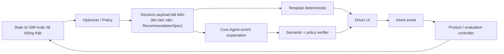

# RESEARCH DRAFT — Core Agent và UI/UX đồng nhất với Simulator

> **Trạng thái:** `RESEARCH-DRAFT v0.1` · ngày 2026-07-30 · snapshot code `be588244`
>
> **KHÔNG phải kiến trúc đã chốt. KHÔNG phải implementation spec. KHÔNG phải acceptance contract.**
> Tài liệu này tổng hợp bằng chứng, lựa chọn thiết kế, trade-off và câu hỏi mở để Cường/team/agent
> tranh luận tiếp. Không có thay đổi runtime, schema, UI hay simulator nào được thực hiện từ tài liệu này.

## 1. Câu hỏi nghiên cứu

Làm thế nào để một **Core Agent**:

1. chuyển quyết định đã được solver/policy chọn thành lời giải thích dễ hiểu cho tài xế;
2. giữ cùng ý nghĩa trên Web, Flutter và research dashboard;
3. hoạt động ổn định khi thay model/provider (OpenAI, DeepSeek, Gemini, Kimi);
4. gọi đúng các tool bổ trợ như thời tiết, lịch sử và state tài xế;
5. tuyệt đối không trở thành optimizer, dispatch engine, chủ sở hữu state hoặc tác nhân làm thay đổi simulator;
6. giúp tài xế hiểu và sử dụng advice tốt hơn mà không gán nhầm uplift thu nhập cho LLM.

### 1.1 Thuật ngữ làm việc

- **Core Agent:** vai trò đề xuất cho lớp diễn đạt/giải thích; chưa đồng nghĩa với một module hay service đã tồn tại.
- **`RecommendationSpec`:** tên làm việc trong tài liệu cho payload quyết định bất biến do solver/policy tạo.
  Repo hiện **chưa có** contract canonical mang tên này. `AdviceEnvelopeV2` đã được chốt ở mức định hướng
  nhưng được ghi rõ là dễ thay đổi và chưa implement (`tracking/PENDING-REVIEW.md`, ĐA-06;
  `tracking/TODO.md`, T-044).
- **Enrichment:** phần giải thích do model tạo từ evidence được cấp. Nó không được thay action, số,
  policy claim, expiry hay state transition.
- **Intent:** điều tài xế bấm trên UI. Intent không chứng minh hành vi đã xảy ra.

## 2. Kết luận tạm thời để tranh luận

### FACT / OBSERVED-CODE

1. Repo đã có C6 theo luồng `Router → Context Pack → Composer → Verifier`, có template fallback và
   code verifier veto (`src/gsm_core/advisor/pipeline.py:49-142`). Đây là nền phù hợp để nghiên cứu
   một explanation layer có kiểm soát.
2. Web product hiện không gọi C6 làm nguồn quyết định canonical. Backend UI tự dựng input MOCK và gọi
   riêng solver S1 (`ui/backend/app/adapters/advisor.py:1-6`, `318-338`). Vì vậy C6, Web và simulator
   chưa chứng minh là ba presentation của cùng một decision.
3. Simulator có `AdviceActionBridge` riêng; adherence coin quyết định follow/ignore, sau đó `world.py`
   có thể đổi action (`src/gsm_sim/advice_bridge.py:332-370`, `405`, `549-571`;
   `src/gsm_sim/world.py:739-771`). Đây là giả định hành vi của SIM, không phải tác động từ UI/Core Agent.
4. Lifecycle đã có `decision_id`, `display_id`, `context_revision`, nhưng contract chưa có
   `presentation_revision`, `render_source` hay `agent_status`
   (`schemas/advisor/advice_lifecycle_event.schema.json:13-18`, `97-106`).
5. Web đã có “Vì sao”, queue khi đang lái và cadence product-side; nhưng `expanded` đang được map thành
   `displayed`, action error bị nuốt và card cũ tự bị xóa khi đủ hai card
   (`ui/backend/app/routers/advice.py:45-47`; `ui/web/js/cards.js:29-37`, `57-70`).
6. Flutter vẫn hiển thị một khối recommendation hard-code, gồm cả SOC, địa điểm, khoảng cách và dự báo
   (`ui/driver_app/lib/screens/home_screen.dart:40-118`). Chưa có parity nội dung với Web/C6/SIM.
7. Đính chính mới nhất xác nhận hai đường explicit/implicit **chưa join được**: product không emit
   `decided`, taxonomy topic rời nhau và từ `followed` đang mang hai nghĩa
   (`specs/adherence-measurement.md`, đính chính 2026-07-30; UPDATE-103).
8. C6 hiện **chưa** phải explanation-only: output hint/client vẫn cho LLM trả `advice_spec`, trong khi
   verifier chưa đối chiếu spec đó với action do solver chọn (`src/gsm_core/advisor/llm_client.py:24-30`,
   `86-101`; `src/gsm_core/advisor/verifier.py:90-106`, `125-135`). Đây là gap, không phải invariant đã có.
9. Không tìm thấy runtime Tool Gateway/function-calling path trong `src/`, `ui/`, `schemas/`; live client
   hiện chỉ gọi text completion JSON (`llm_client.py:86-100`). Tool use ở §7 là hướng nghiên cứu.

### HYPOTHESIS

Hướng đáng thử trước là **template-first, agent enrich phần “Vì sao?”**, vì nó giữ card dùng được khi
model chết và giới hạn phần model được phép thay đổi. Đây chỉ là hypothesis cần usability test và
multi-model eval; chưa phải quyết định implementation.

### Điều tài liệu này không kết luận

- Không kết luận Core Agent làm tăng thu nhập.
- Không kết luận model/provider nào tốt nhất.
- Không kết luận runtime nên in-process hay service.
- Không kết luận schema mới, tên field hay event flow đã được duyệt.
- Không kết luận short counterfactual và fleet interference đã được giải quyết.
- Không kết luận Web/Flutter/SIM hiện đã parity.

## 3. Ranh giới vai trò cần giữ



Các cạnh **không được tồn tại** trong hướng nghiên cứu này:

```text
Core Agent → Simulator state
Core Agent → AdviceActionBridge
Core Agent → Dispatch / matching / pricing / routing
Core Agent → Solver decision hoặc solver objective
Core Agent → tự tạo policy fact / số tiền / threshold / confidence
```

`Product / evaluation controller` ở sơ đồ không có nghĩa agent được điều khiển SIM. Nó nhấn mạnh
rằng chỉ code ứng dụng/evaluation đã validate mới được xử lý intent; agent không sở hữu cạnh đó.

## 4. Vì sao cần Core Agent — và khi nào không cần

| Tình huống | Template đủ? | Giá trị tiềm năng của Core Agent | Rủi ro |
|---|---:|---|---|
| Action, số và câu giải thích đều cố định | Có | Gần như không có | Thêm latency/cost/failure không cần thiết |
| Cần diễn đạt trade-off từ evidence đã có | Có thể thiếu | Rút gọn và diễn đạt theo ngữ cảnh | Model thêm claim ngoài evidence |
| Tài xế hỏi “vì sao?” | Thường thiếu | Giải thích nhiều mức, dùng cùng evidence | Trượt thành chat tự do |
| Cần thay đổi giọng văn/ngôn ngữ | Một phần | Cá nhân hóa cách nói, không cá nhân hóa quyết định | Wording có thể đổi hàm ý |
| Cần gọi weather/history/state để xác nhận | Không phải lúc nào | Thu thập evidence bổ trợ trước khi giải thích | Gọi sai tool hoặc dùng data stale |

Nguyên tắc tư vấn: nếu một scenario không chứng minh được Core Agent tạo thêm giá trị so với template,
scenario đó nên dùng template. “Có LLM” không phải outcome sản phẩm.

## 5. Các lựa chọn kiến trúc để cân nhắc

### Lựa chọn A — Template only

**Mô tả:** mọi card và “Vì sao?” do template deterministic tạo.

- Ưu: dễ audit, nhanh, không phụ thuộc provider, phù hợp fallback.
- Nhược: câu giải thích cứng; khó trả lời trade-off hoặc câu hỏi phụ.
- Phù hợp làm baseline bắt buộc cho mọi experiment.
- Câu hỏi mở: bao nhiêu use case thực sự không thể giải thích tốt bằng template?

### Lựa chọn B — Stable card + bounded “Vì sao?” enrichment

**Mô tả:** title, action, số, expiry, caveat và CTA xuất hiện ngay từ template; model chỉ trả một
explanation revision dựa trên evidence đã cấp.

- Ưu: fallback tự nhiên; card không đổi quyết định; phù hợp progressive disclosure.
- Nhược: cần cơ chế chống revision đến muộn/stale và semantic verifier mạnh hơn schema validation.
- **Hướng nghiên cứu ưu tiên**, chưa phải kiến trúc đã duyệt.
- Câu hỏi mở: explanation có làm tài xế hiểu đúng hơn đủ để bù latency/cost hay không?

### Lựa chọn C — Agent thay toàn bộ nội dung card

**Mô tả:** model render cả title, body, caveat và CTA từ decision payload.

- Ưu: linh hoạt giọng văn cao.
- Nhược: layout shift, khó attribution revision, nguy cơ đổi hàm ý action/số/policy.
- Nhận định nghiên cứu: không nên là baseline; chỉ mở lại nếu B thất bại trong user study.

### Lựa chọn D — Agent tự chọn decision/tool/action

**Mô tả:** model tự quyết advice, gọi solver/dispatch hoặc ghi simulator.

- Không phù hợp ranh giới sản phẩm hiện hành.
- Không đưa vào V1 research vì biến agent thành optimizer/orchestrator và phá khả năng quy trách nhiệm.

### So sánh nhanh

| Tiêu chí | A Template | B Bounded enrich | C Full render | D Agent decision |
|---|---:|---:|---:|---:|
| An toàn/fail-closed | Cao | Khá cao nếu verifier tốt | Trung bình/thấp | Thấp |
| Giá trị giải thích | Thấp–trung bình | Cao | Cao | Không đúng bài toán |
| Portability model | Rất cao | Cao nếu contract trung lập | Trung bình | Thấp |
| Latency trên đường card | Không | Không nếu async | Có | Có |
| Phù hợp code/guardrail hiện tại | Cao | Khá cao | Thấp | Không |

## 6. Model portability: lựa chọn và giới hạn

### Bằng chứng nhà cung cấp

- OpenAI phân biệt JSON mode với Structured Outputs; JSON mode chỉ bảo đảm JSON hợp lệ, còn strict
  structured output/function schema mới nhằm bảo đảm schema adherence. Strict mode yêu cầu các object
  có `additionalProperties: false` và mọi property được đánh dấu required
  ([OpenAI function calling](https://developers.openai.com/api/docs/guides/function-calling#strict-mode),
  [Structured Outputs](https://developers.openai.com/api/docs/guides/structured-outputs#structured-outputs-vs-json-mode)).
- Gemini xác nhận application là bên thực thi function, không phải model; tài liệu cũng yêu cầu validate
  value trong application và xử lý output đúng schema nhưng sai ngữ nghĩa
  ([Gemini tools](https://ai.google.dev/gemini-api/docs/tools),
  [structured output](https://ai.google.dev/gemini-api/docs/structured-output)).
- DeepSeek có JSON mode nhưng cảnh báo có thể trả empty content; strict tool schema là beta và chỉ hỗ trợ
  một subset JSON Schema ([DeepSeek JSON Output](https://api-docs.deepseek.com/guides/json_mode/),
  [Tool Calls](https://api-docs.deepseek.com/guides/tool_calls/)).
- Kimi công bố API tương thích OpenAI Chat Completions và tool-call loop do application thực thi;
  tài liệu đã đọc chưa đủ để khẳng định parity strict-schema với OpenAI
  ([Kimi API overview](https://platform.kimi.ai/docs/api/overview),
  [Tool Calls](https://platform.kimi.ai/docs/guide/use-kimi-api-to-complete-tool-calls)).

### Ba chiến lược

| Chiến lược | Lợi | Hại | Nhận định nghiên cứu |
|---|---|---|---|
| Provider-native contract | Tận dụng strict/tool feature tốt nhất | Prompt/schema rẽ nhánh, khó đổi model | Hợp cho adapter, không nên là domain contract |
| Common-minimum internal contract + provider adapters | Một nghĩa nghiệp vụ; app tự validate | Phải xây eval và normalize lỗi từng provider | Hướng ưu tiên để thử |
| Prompt trả text rồi parse | Dễ prototype | Không đáng tin cho financial/policy UI | Chỉ dùng khám phá, không dùng làm gate |

Common-minimum không có nghĩa “mọi provider chắc chắn giống nhau”. Nó có nghĩa domain chỉ nhận một
payload đã qua adapter + schema validation + semantic validation. Provider response nguyên bản phải
được giữ trong research trace, không chảy thẳng vào UI.

### Contract tối thiểu cần nghiên cứu, chưa chốt field

```text
explanation_id
decision_id
decision_content_hash
language / length_variant
explanation_text
evidence_refs[]
caveat_refs[]
provider_status
```

Các field trên là đề bài cho contract workshop, không phải yêu cầu tạo schema ngay.

## 7. Tool use: các lựa chọn

### T0 — Không tool

Agent chỉ diễn đạt evidence có sẵn trong decision payload. An toàn nhất; phù hợp baseline.

### T1 — Read-only allowlist

Agent được đề nghị application gọi một số tool bổ trợ:

- `get_weather_snapshot`;
- `get_driver_state_snapshot`;
- `get_driver_history_summary`;
- `retrieve_policy_facts` (chỉ khi T-004/PolicyFact đã approved, versioned, exact-track/time-valid).

Application mới là bên xác thực quyền, validate args, thực thi, timeout, retry và normalize output.
Tool result chỉ được bổ sung explanation hoặc tạo verdict “cần xác nhận”; không được đổi solver action.

### T2 — Tool rộng hoặc có quyền ghi

Bao gồm dispatch, simulator state, solver mutation hoặc DB operation. Không phù hợp phạm vi Core Agent.

### Quy tắc cần chứng minh trước khi implementation

1. Tool registry có allowlist theo intent; model không nhìn thấy tool ngoài scope.
2. Args validate độc lập với model; unknown field bị reject.
3. Output được normalize với `source`, `event_time`, `ingested_at`, `freshness`, `data_mode`.
4. Timeout/stale/error trả fallback; không “đoán tiếp”.
5. Tool output mâu thuẫn decision payload không được tự override; tạo trace + suppress/caveat.
6. Không có tool nào tên hoặc quyền tương đương `write_sim_state`, `apply_action`, `dispatch_trip`.

## 8. UI/UX: lựa chọn thiết kế để thử

### 8.1 Enrichment pattern

| Pattern | Mô tả | Điểm mạnh | Điểm yếu |
|---|---|---|---|
| E0 | Template only | tức thời, ổn định | explanation hạn chế |
| E1 | Stable core + “Vì sao?” enrich | không block card; progressive disclosure | cần stale/revision logic |
| E2 | Agent thay card | linh hoạt | card đổi sau khi tài xế đã đọc |
| E3 | Card agent/chat thứ hai | tách rõ nguồn | tăng nhiễu, chiếm màn hình |

E1 là hypothesis ưu tiên. Google PAIR khuyến nghị giải thích đủ để người dùng ra quyết định và dùng
progressive disclosure thay vì nhồi mọi chi tiết vào active flow
([PAIR patterns](https://pair.withgoogle.com/guidebook-v2/patterns)). Nội dung enrich tải muộn phải
có vùng đã dự trữ để tránh layout shift ([web.dev CLS](https://web.dev/articles/optimize-cls)).

### 8.2 Các tầng thông tin

1. **Card core:** context, title, one-line advice, số/unit, expiry, caveat, CTA, mock/live badge.
2. **“Vì sao?” ngắn:** một câu giải thích từ template hoặc agent.
3. **Evidence/trade-off:** chỉ các evidence/caveat đã được cấp.
4. **Follow-up có cấu trúc:** chỉ khi tài xế dừng; không phải free-form chat trong baseline.

### 8.3 Khi tài xế đang lái

Các lựa chọn:

- U1 bỏ card đang đến;
- U2 queue và present khi `idle/rest/charge`;
- U3 voice ngay khi đang chạy.

U2 là hướng nghiên cứu phù hợp hơn vì không làm mất advice và giảm visual/manual distraction. Repo mới
đã có product-side queue trong `advice.py:138-168`; cần kiểm UX ở V-18, không xây một luật thứ hai trong
agent. NHTSA coi tương tác visual/manual là nguồn distraction cần hạn chế
([NHTSA guidance](https://www.nhtsa.gov/document/visual-manual-nhtsa-driver-distraction-guidelines-vehicle-electronic-devices)).
Voice để future research, không tự mặc định là an toàn hơn.

### 8.4 Card budget

Hiện Web giữ tối đa hai card rồi xóa card cũ không có event superseded (`cards.js:69-70`). Các lựa chọn:

- B1 một active card + queue deterministic;
- B2 hai active card như hiện tại;
- B3 agent tự xếp hạng/supersede.

B1 nên được prototype trước vì dễ hiểu và attribution, nhưng cần user test; B3 nằm ngoài ranh giới agent.
Card bị thay phải có trạng thái `superseded`, không biến mất im lặng.

### 8.5 CTA và ý nghĩa đo lường

| Bộ CTA | Cách hiểu | Rủi ro |
|---|---|---|
| Hiện tại: `Làm theo / Bỏ qua / Vì sao` | dễ hiểu nhanh | “Làm theo” dễ bị đọc nhầm là hành vi thật |
| Đề xuất thử: `Tôi sẽ thử / Không phù hợp / Để sau` | nói rõ đây là intent | dài hơn, cần usability test |

Nếu dùng bộ thứ hai, `Không phù hợp` có quick reason tùy chọn: sai thời điểm, không khả thi, chưa rõ,
không quan tâm. Dù chọn bộ nào, event phải mang nhãn `self_reported_intent`, không được gọi là
`followed_behavior`.

### 8.6 Presentation state — mô hình khái niệm

```text
template_ready
→ enrichment_requested
→ enrichment_available | template_only
→ expired | superseded
```

Không phải mọi state đều cần hiển thị cho driver. Nếu explanation đến sau khi card đã expired,
superseded hoặc tài xế đã action, revision chỉ vào research trace. Template phải xuất hiện trước;
Apple HIG khuyến nghị hiển thị nội dung sớm và tải nền không làm gián đoạn trải nghiệm
([Apple Loading](https://developer.apple.com/design/human-interface-guidelines/loading)).

### 8.7 Surface parity

- Mobile: card + bottom sheet cho “Vì sao”.
- Desktop/research: card + side inspector/timeline.
- Cùng semantics và content contract; không yêu cầu pixel-identical.
- Flutter hard-code hiện tại là gap phải được giải quyết ở cycle implementation riêng thuộc claim T-009b;
  tài liệu này không sửa Flutter.

## 9. Đồng nhất với simulator mà không để agent chạm simulator

### 9.1 “Đồng nhất” nên có nghĩa gì

- Cùng `decision_id`/decision payload semantics cho presentation và research trace.
- Cùng cách gọi action, evidence, caveat, expiry và intent.
- Research dashboard có thể đọc template revision/agent revision để giải thích tài xế đã thấy gì.
- Không có nghĩa Simulator phải gọi LLM trong action loop.
- Không có nghĩa bấm UI hiện tại là `followed` trong SIM.

### 9.2 Shadow-only bridge cho nghiên cứu

Một hướng cần thử sau khi contract được duyệt:

```text
SIM decision trace (read-only copy)
→ template presentation
→ optional agent explanation
→ research dashboard

SIM action/state path: giữ nguyên, không nhận output agent
```

Hard invariant đề xuất cho experiment: với cùng seed/config/decision payload, state fingerprint của SIM
phải giống nhau khi agent `off` và `shadow`. Nếu khác, ranh giới đã bị phá.

### 9.3 Trace reviewer mong muốn — chưa có đầy đủ

```text
state trước decision
→ solver report / policy facts
→ decision payload
→ template thực sự hiển thị
→ agent revision (nếu có)
→ intent tự khai
→ SIM behavior event (nếu đang review SIM)
→ outcome cá nhân
→ outcome fleet
```

Current lifecycle có một số ID nền, nhưng chưa có presentation revision/render source và hai taxonomy
product/SIM chưa join được. Vì vậy sơ đồ trên là target nghiên cứu, không phải capability hiện tại.

## 10. Đo hiệu quả: tách UX khỏi causal/business impact

### 10.1 Experiment presentation — chỉ đo agent/UI

Giữ frozen decision payload:

- **P0:** template only;
- **P1:** template + agent on-demand khi mở “Vì sao?”;
- **P2:** template + deterministic prefetch;
- **P3:** template driver-facing, agent chỉ chạy shadow cho reviewer.

Đo trước:

- schema pass, semantic pass, timeout, fallback, stale suppression;
- model/provider parity theo golden cases;
- hiểu đúng action, lý do, caveat, expiry;
- time-to-understand, tap, dismiss/snooze, accidental tap;
- interruption khi lái, layout shift, usefulness/trust.

Không dùng follow rate đơn độc làm north-star.

### 10.2 Business impact — không được gán cho Core Agent

Chuỗi tác động đúng:

```text
optimizer/policy tạo decision có giá trị
→ UI/agent giúp tài xế hiểu
→ tài xế hình thành intent
→ hành vi thực tế thay đổi
→ outcome cá nhân/fleet thay đổi
```

Core Agent chỉ tác động trực tiếp tới bước hiểu/intent. Muốn nói nó tăng thu nhập phải có experiment tách
presentation khỏi decision và xử lý selection/adherence/interference.

### 10.3 Hai hạn chế cũ vẫn còn nguyên đối với nghiên cứu agent

1. **Chưa đo nhân quả từng advice.** Twin-world dài hạn và intent click không trả lời “chính lần follow
   này tạo thêm/mất bao nhiêu”. Cần short counterfactual branch hoặc phương pháp causal window độc lập.
2. **Chưa mô hình hóa đầy đủ phản ứng toàn hệ thống.** Khi nhiều tài xế nhận cùng decision, cung có thể
   dồn, advice mất hiệu lực và khách chịu ảnh hưởng. Anti-herding trong SIM không chứng minh production
   dispatch/equilibrium đã an toàn.

Agent enrichment không sửa hai hạn chế này. Trộn experiment P0–P3 với thay đổi solver/adherence sẽ làm
mất attribution.

## 11. Các gate nghiên cứu trước khi xin duyệt implementation

| Gate | Câu hỏi phải trả lời | Evidence tối thiểu |
|---|---|---|
| R0 Boundary | Team có chốt agent chỉ explanation không? | sơ đồ và danh sách cạnh cấm được duyệt |
| R1 Canonical decision | Payload nào là nguồn sự thật chung? | mapping C6/S1/SIM, không còn ba nghĩa |
| R2 Contract portability | Bốn provider trả cùng semantics được không? | golden set + malformed/stale/tool cases |
| R3 Semantic verifier | Schema đúng nhưng claim sai bị chặn không? | adversarial eval cho số/policy/action/citation |
| R4 UX prototype | E0/E1/E2 giúp hiểu khác nhau thế nào? | usability test khi dừng; không code production |
| R5 SIM shadow invariant | Agent on/off có giữ nguyên state không? | per-actor fingerprint identical |
| R6 Measurement | Intent và behavior đã tách tên/join đúng chưa? | denominator + independent ground truth |
| R7 Approval | Scope/code owner/visual gate được duyệt chưa? | plan implementation riêng |

Chỉ sau R7 mới viết schema/runtime/UI. Tài liệu hiện tại không làm cho gate nào tự động PASS.

## 12. Câu hỏi mở cần Cường/team cân nhắc

1. `RecommendationSpec` sẽ là contract mới hay adapter view của `AdviceEnvelopeV2`?
2. Core Agent có được giải thích mọi card hay chỉ một số reason code có trade-off phức tạp?
3. “Vì sao?” mặc định template hay agent; khi nào prefetch đáng chi phí?
4. Giới hạn latency/cost/fallback SLO là gì cho mobile?
5. Provider nào là reference implementation, và provider nào là compatibility target?
6. Kimi chưa có bằng chứng strict-schema parity tương đương OpenAI; ta chấp nhận common subset nào?
7. Tool nào thật sự cần cho explanation, tool nào nên được solver/data layer gọi trước?
8. Policy graph T-004 sẽ trả `PolicyFact` approved theo exact track/as-of như thế nào?
9. Evidence conflict giữa weather/state/policy và decision payload sẽ dẫn tới caveat hay suppress?
10. CTA nào diễn đạt intent đúng nhất với tài xế Việt Nam?
11. Một active card có làm mất advice quan trọng không; queue rule do policy nào sở hữu?
12. Web/Flutter/research trace cần parity semantics đến mức nào ở V1?
13. Có cần lưu provider/model/prompt/tool payload; retention và PII policy là gì?
14. Khi nào free-form follow-up đủ giá trị để mở, và guardrail nào bắt buộc trước đó?

## 13. Evidence matrix tại `be588244`

| Claim | Nhãn | Bằng chứng | Tác động |
|---|---|---|---|
| C6 có template + composer + verifier fail-closed | `OBSERVED-CODE` | `src/gsm_core/advisor/pipeline.py:49-164` | có nền explanation an toàn, chưa chứng minh live/model parity |
| Live client chỉ JSON mode qua OpenAI-compatible API | `OBSERVED-CODE` | `src/gsm_core/advisor/llm_client.py:51-101` | JSON parse được chưa đủ semantic/strict portability |
| LLM hiện được phép sinh `advice_spec` | `OBSERVED-CODE — GAP` | `src/gsm_core/advisor/llm_client.py:24-30`, `86-101`; `composer.py:27-32` | chưa đạt boundary enrich-only |
| Verifier chưa pin `advice_spec` về solver action | `OBSERVED-CODE — GAP` | `src/gsm_core/advisor/verifier.py:90-106`, `125-135` | output đúng schema vẫn có thể đổi decision semantics |
| Runtime Tool Gateway chưa có | `OBSERVED-CODE — ABSENT` | negative search `tool_calls/function_call/tool_choice` trong `src/`, `ui/`, `schemas/`; `llm_client.py:86-100` | weather/history/state tools mới là research direction |
| UI advice là S1 adapter riêng, không phải C6 | `OBSERVED-CODE` | `ui/backend/app/adapters/advisor.py:1-6`, `318-338` | canonical decision source chưa có |
| Current advice contract thiếu presentation revision/source | `OBSERVED-CODE` | `ui/contracts/advice.json:22-54` | không biết tài xế thấy template hay agent revision |
| Lifecycle có decision/display/context ID nền | `OBSERVED-CODE` | `schemas/advisor/advice_lifecycle_event.schema.json:13-18`, `97-106` | có thể nghiên cứu mở rộng thay vì tạo store thứ hai |
| `expanded` bị map thành `displayed` | `OBSERVED-CODE` | `ui/backend/app/routers/advice.py:45-47` | exposure và explanation-open bị trộn |
| UI action error bị nuốt; card tự evict | `OBSERVED-CODE` | `ui/web/js/cards.js:29-37`, `57-70` | measurement và trust có thể sai |
| Queue while driving đã nằm ở product cadence | `OBSERVED-CODE` | `ui/backend/app/routers/advice.py:138-168` | agent không nên tạo timing policy thứ hai |
| Flutter recommendation còn hard-code | `OBSERVED-CODE` | `ui/driver_app/lib/screens/home_screen.dart:40-118` | chưa có Web–Flutter parity |
| SIM bridge tự coin follow và đổi action | `OBSERVED-CODE` | `src/gsm_sim/advice_bridge.py:405`, `549-571`; `src/gsm_sim/world.py:739-771` | không được nối agent text vào action path |
| Explicit/implicit chưa join được | `DOCS-CORRECTION + CODE-EVIDENCE` | `specs/adherence-measurement.md` đính chính 2026-07-30; UPDATE-103 | chặn attribution intent→behavior |
| AdviceEnvelopeV2 đã chốt nhưng dễ thay đổi/chưa implement | `DECISION-DOC` | `tracking/PENDING-REVIEW.md:90`; `tracking/TODO.md:246-263` | research phải phối hợp T-044, không tự tạo contract cạnh tranh |
| Live LLM smoke chưa có | `UNVERIFIED` | `tracking/DEFERRED.md:22` (`D-C6-03`) | chưa claim OpenAI/DeepSeek/Gemini/Kimi chạy thật trong repo |

## 14. Adversarial review của chính tài liệu

1. Từ “Core Agent” dễ làm người đọc tưởng đây là một service đã tồn tại; thực tế đây là vai trò nghiên cứu.
2. `RecommendationSpec` dễ bị coi là contract đã duyệt; tài liệu đã đánh nhãn working term.
3. Structured output dễ tạo cảm giác an toàn giả. Schema compliance không chứng minh số/policy/action đúng.
4. “Provider compatible” dễ bị suy thành identical behavior; mỗi provider cần eval riêng.
5. Progressive disclosure có thể che caveat quan trọng; caveat bắt buộc không được giấu hoàn toàn.
6. Queue khi lái có thể làm advice stale; expiry/freshness phải thắng nhu cầu “nói cho đủ”.
7. Agent shadow trong SIM vẫn có thể vô tình làm đổi RNG/timing nếu được đặt trong loop; invariant fingerprint
   phải kiểm tra ở boundary, không chỉ dựa vào code review.
8. Research dashboard có thể khiến reviewer tin click là follow; tên event phải tách intent/behavior.
9. Tài liệu dựa trên snapshot `be588244`; bằng chứng code cần re-verify trước implementation nếu main đổi.

## 15. Phán quyết tài liệu

Tài liệu này chỉ đủ để mở một **design debate có bằng chứng**. Hướng `template-first + bounded “Vì sao?”`
là ứng viên nên prototype/evaluate trước, không phải phương án hoàn chỉnh. Bước tiếp theo hợp lệ là Cường/team
chọn các câu hỏi ở §12 và duyệt một research gate cụ thể; bước tiếp theo **không phải tự động viết code**.
