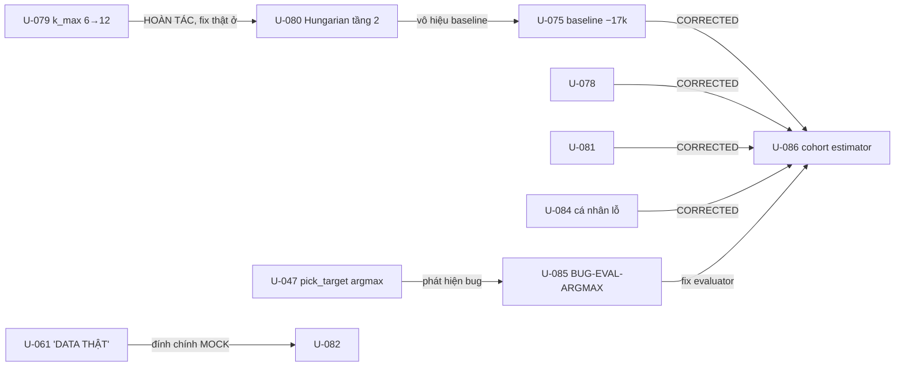

# PROJECT-GRAPH — ADDENDUM 2026-07-29 (UPDATE-073..091)

> **Vai trò:** `tracking/PROJECT-GRAPH.md` §3 dừng ở UPDATE-072. File này phủ **073–091**
> (19 update của đợt 2026-07-27..29) theo cùng ngữ nghĩa node/edge. Khi reconcile chính
> thức, gộp nội dung này vào graph gốc rồi xoá file. Nguồn: 5 reader agent đọc từng file
> UPDATE (fan-out), controller tổng hợp; mọi edge đều nêu TƯỜNG MINH trong file gốc,
> không suy diễn.

## 1. Bảng node

| ID | Title | Status | Một dòng | Đọc kèm |
|---|---|---|---|---|
| 073 | UI-FARE-01: thống nhất giá Simulator/Web qua PolicyBundle | WAITING-VERDICT (V-16) | Một adapter pricing MOCK canonical; xoá formula 24000/km; ledger byte-equivalent | `ui/backend/app/adapters/sim_pricing.py` · `ui/docs/SCREEN-PARITY.md` |
| 074 | Gỡ BLOCKER-R5-MUT10 + truy nguyên advisor lỗ tiền | DONE-CODE | MUT10 (DP tưởng pin bền gấp đôi) restore + re-apply→đỏ; ablation chỉ đích danh `accept_lift` −105k | `src/gsm_core/solvers/shift_dp.py` · hồ sơ `06-why-advice-loses-money.md` |
| 075 | ĐA-08 bước 1: guardrail 4 tầng + baseline 30 seed | **CORRECTED** | Bộ metric gini/HHI/customer/system + baseline coverage:all; số "tài xế đích −17.310đ" sau bị lật (argmax bias) | `src/gsm_sim/sim_metrics.py` · artifact `09`/`24` |
| 076 | C2 đợt 1: advisor phải nói thật (S1/S5 đọc `feasible`) | BLOCKED (visual) | already_maxed hết trấn an khi thưởng về 0đ; seed provenance thật; mẫu lỗi consumer-không-đọc-producer | `src/gsm_core/advisor/templates.py` · hồ sơ `08-parity` |
| 077 | ĐA-01: shrinkage estimator — gỡ rò tương lai acceptance | WAITING-VERDICT (V-14) | `shrunk_rate` Beta-Binomial 7-ngày-trước thay oracle cuối ngày; 16/60 tài xế đổi phía ngưỡng 0,85 | `src/gsm_core/rates.py` |
| 078 | BUG-S2-PARAMS (bucket 60′ vs DP 30′) + sim không đo được giá trị nghỉ | **CORRECTED** | consult không truyền params ⇒ DP sai pin/nghỉ; phát hiện spec §5b: không có hậu quả mệt thì thước không thưởng nghỉ | hồ sơ `10`/`11` · `specs/advisor-objective-model-v2.md` |
| 079 | Root cause thật: shortlist/pin/biên giới cung–cầu | WAITING-VERDICT (Q-07) | Fix k_max 6→12 **ĐÃ HOÀN TÁC**; chi phí pin chưa vào mô hình; served↔trips đối nghịch 0/16; sinh T-046 | hồ sơ `12`/`13`/`14` |
| 080 | Dispatcher tầng 2 (batched Hungarian) + nhãn MOCK SOC + Q-08 | WAITING-VERDICT | Tầng 2 có trong đặc tả nhưng chưa từng xây; **vô hiệu mọi baseline cũ**; nhãn MÔ PHỎNG đi cùng dữ liệu | `src/gsm_sim/dispatcher.py` · hồ sơ `15` |
| 081 | Tài xế biết sốt ruột + baseline sau tầng 2 | **CORRECTED** | Cắt đuôi chờ 269′→59′ (Q-08 ranh giới); số tài xế đích vẫn argmax-bias | `src/gsm_sim/behavior.py` · artifact `17`/`24` |
| 082 | Reconcile current state (T-040) + ghi B-01/B-02 | DONE-CODE | Dossier 6 file; chốt ĐA-01..03 approved; đề xuất ĐA-04..06; đính chính "DATA THẬT"→MOCK của 061 | `research/audit/2026-07-27-current-state/README.md` |
| 083 | 3 time bug + MarketState producer + drop-bám-cầu + hồi sinh S4 | WAITING-VERDICT | Nhãn bucket mất NGÀY/bucket ma/ghost overtime; corr drop −0,222→+0,418 (α=0.4); S4 Hungarian trần theo ô | `src/gsm_sim/market_state.py` · `demand.py` · artifact `20` |
| 084 | b4: đo kênh vị trí 30 seed | **CORRECTED** | Kênh ĐẦU TIÊN cứu hệ thống SIG (served +1,03đp, HHI giảm); "cá nhân vẫn lỗ" sau bị lật (argmax) | artifact `21`/`24` · hồ sơ `18` |
| 085 | Cycle R+P + **phát hiện BUG-EVAL-ARGMAX** | DONE-CODE | Tín dụng nghỉ đơn điệu, SWAP trước REST; chứng minh sign-flip: chuỗi "advisor làm nghèo" là artifact THƯỚC | `shift_dp.py` · artifact `22` |
| 086 | Estimator không bias (cohort) — positioning dương SIG | DONE-CODE | Placebo Δ=0 từng seed; B0 = −466đ ns; positioning +3,5–5k SIG; kẹt veto 9 → Q-12 | `src/gsm_sim/parallel.py` · artifact `24` |
| 087 | Xác nhận 100 seed tươi + đề xuất B3w | WAITING-VERDICT→duyệt ở 089 | PASS 9/9 ĐA-08 (+6.016đ SIG, n=100 seed 3000–3099); shift_plan không thêm giá trị | artifact `25` |
| 088 | Cycle Q — ĐA-09: equilibrium/PoA/coverage | DONE-CODE | Cân bằng tồn tại ≈ λ_config (γ=1, 1 vòng); γ=0 KHÔNG hội tụ, tệ vĩnh viễn; PoA 51–73%; bẫy free-rider 25–50% | `research/simulation/multi-agent-equilibrium.md` · artifact `27`/`28` |
| 089 | Bật positioning wait_only mặc định + chốt tiêu chí ĐA-08 (1a+1b) | DONE-CODE (V-17 treo) | Cường duyệt; shift_plan TẮT theo điều-khoản-bản-cuối ĐA-07; 5/7 archetype dương SIG, 0/7 bị hại | `configs/pilot_dongda.yaml` |
| 090 | Cycle V: registry schema ĐA PHIÊN BẢN + upcaster (gỡ B-02) | DONE-CODE | Route theo `record[schema_version]`, fail-loud; backward-compat = điều được TEST; bump đầu tiên 1.1.0 | `src/gsm_core/schema_registry.py` · `upcasters.py` |
| 091 | Cycle W: ĐA-05 lifecycle store + projections một-luật | DONE-CODE / WAITING-VERDICT | 3 store → 1 event log append-only; `decision_adherence`+`event_adherence` (HAI TÊN); 36 finding/4 lượt review sửa hết; suite 707/5 | `src/gsm_core/lifecycle/` · `research/audit/2026-07-29-cycle-w-review/findings.md` |

## 2. Correction chains (đọc CHIỀU MŨI TÊN = "bị sửa bởi")

**Luật đọc quan trọng nhất:** mọi con số *payout "tài xế đích"* trong 075/078/081/084 là
CORRECTED — số hiện hành lấy từ artifact `24-unbiased-30seed.json` (UPDATE-086) và
`25-confirm-100seed.json` (UPDATE-087). Số tầng HỆ THỐNG (served/HHI/Gini/tổng payout đội)
của các file đó KHÔNG bị ảnh hưởng.

## 3. Route đọc theo task

| Task chạm vào | Đọc theo thứ tự | Source-of-truth kèm |
|---|---|---|
| Sim behavior / thời gian / dispatcher | 080 → 081 → 083 (3 time bug) | `configs/pilot_dongda.yaml` · `src/gsm_sim/{dispatcher,behavior,world}.py` · Q-07/Q-08 trong PENDING-REVIEW |
| Đo lường A/B / adherence / estimator | **085 → 086 → 087** (bắt buộc, tránh dùng số CORRECTED) → 091 (adherence hai tên) | `src/gsm_sim/parallel.py` · `specs/adherence-measurement.md` · `research/audit/2026-07-29-cycle-w-review/findings.md` |
| Positioning / S4 / market state | 079 (root cause) → 083 (b2/b3) → 084 → 086/087 → 089 (verdict) | `specs/advisor-objective-model-v2.md` §2–3 · `src/gsm_core/solvers/capacity_alloc.py` |
| Schema / registry / versioning | 090 → (091 dùng nó) | `schemas/README.md` · `schemas/CHANGELOG.md` · `tests/test_schema_versioning.py` |
| Lifecycle store ĐA-05 / event log | 091 + hồ sơ findings 36 mục | `src/gsm_core/lifecycle/{event_log,projections}.py` · PLAN-cycle-wx Phần B |
| UI web/backend | 073 (fare) → 076 (nói thật) → 077 (shrunk_rate) → 091 (actions→store) | `ui/docs/SCREEN-PARITY.md` · `ui/contracts/advice_action.json` · UPDATE-092 (teammate, B6-PARITY) |
| Equilibrium / multi-agent | 088 (+ 089 nhắc free-rider) | `research/simulation/multi-agent-equilibrium.md` |

## 4. Trạng thái mở tại 2026-07-29

- **WAITING-VERDICT:** 073 (V-16) · 077 (V-14) · 079 (Q-07) · 080 (Q-07 liên đới) · 083/084 (V-queue) · 087→089 (V-17) · **091 (ĐA-05 code)**.
- **BLOCKED:** 076 (visual — mock không dựng được ca thật).
- **UNRESOLVED:** k_max shortlist (BLOCKED-Q-07 — TODO c0 đã đính chính 2026-07-29).
- **Kế tiếp đã duyệt:** PLAN-cycle-wx Phần B (B1 `net_mean_all` DONE-CODE `8fc02ba` → B2 C1 → B3 policy costs → B4) · finding sống sót của UPDATE-092: `format_checker` (15 schema) — cần plan mode.
