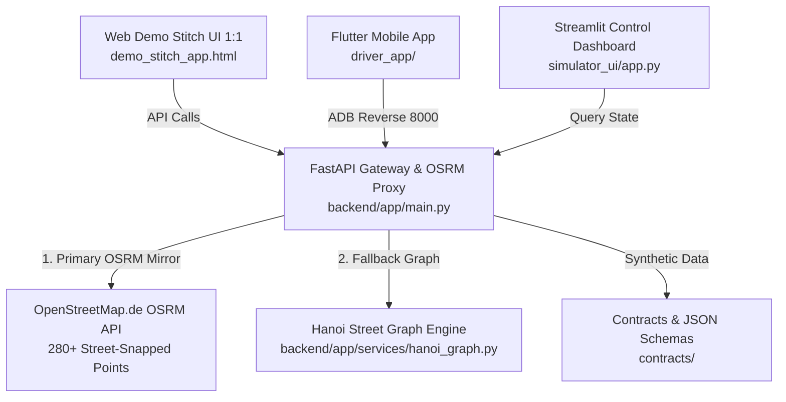

# 🚕 GSM Driver UI/UX & Real-Road OSRM Navigation System

> **Ứng dụng Tài xế Xe điện GSM (Xanh SM Driver App)** - Hệ thống Giao diện Stitch UI 1:1, Động cơ Chỉ đường Thực tế OSRM 280+ Tọa độ Tim đường Hà Nội & Dashboard Mô phỏng Đa điểm dừng.


---

## 📖 Tổng Quan Kiến Trúc Hệ Thống (System Architecture)

Dự án được cấu trúc theo mô hình Modular Decoupled Architecture gồm 5 thành phần chính:



### 📁 Cấu Trúc Thư Mục Dự Án (Project Directory Structure)

```text
UIUXgsm/
├── backend/                  # Python FastAPI API Gateway & OSRM Server Proxy
│   ├── app/
│   │   ├── main.py           # FastAPI Application Entrypoint & CORS Config
│   │   ├── models.py         # Pydantic Schemas (TripStepResponse, Waypoints)
│   │   ├── simulator.py      # Data Generator & Hanoi Charging Stations
│   │   ├── routers/
│   │   │   └── routing.py    # OSRM Proxy & Multi-Stop Waypoint Calculator
│   │   └── services/
│   │       └── hanoi_graph.py# Hanoi High-Density Node Graph Engine (500+ Nodes)
│   └── tests/                # Pytest Test Suite (100% Green Coverage)
│       ├── test_hanoi_graph.py
│       └── test_routing_api.py
│
├── driver_app/               # Flutter Mobile App Cho Tài Xế Android
│   ├── lib/
│   │   ├── main.dart         # Flutter App Entrypoint & Stitch ThemeData (#00AFB9)
│   │   ├── screens/          # 5-Tab Navigation (Xanh Now, Order, Earnings, EV, Settings)
│   │   ├── widgets/          # Map Widget, Alert Cards, KPI Bottom Sheets
│   │   └── services/         # API Integration & Location Tracking
│   └── android/              # Android Manifest & ADB Config
│
├── simulator_ui/             # Dashboard Điều Khiển Ca Lái Xe & Giám Sát Real-Time
│   └── app.py                # Streamlit + Leafmap Operations Panel (Port 8501)
│
├── contracts/                # Schema JSON Chuẩn Hóa Giao Tiếp Dữ Liệu
│   ├── map_context.json
│   └── driver_state.json
│
├── docs/                     # Tài Liệu Kỹ Thuật & Hướng Dẫn Tối Ưu Hóa
│   ├── GSM_DRIVER_OSRM_MAP_ANDROID_OPTIMIZATION_GUIDE.md
│   └── superpowers/plans/    # Implementation Plans & Walkthroughs
│
├── demo_stitch_app.html      # Bản Web UI Demo Tương Tác Full Tính Năng 1:1 Stitch
├── .gitignore                # File Cấu Hình Bảo Mật & Loại Bỏ File Rác
├── .env.example              # Mẫu Khai Báo Biến Môi Trường API Key
└── README.md                 # Tài Liệu Hướng Dẫn Sử Dụng Chi Tiết
```

---

## ✨ Các Tính Năng Nổi Bật (Key Features)

### 1. 🎨 Giao Diện Chuẩn 1:1 Google Stitch Design System
- **Tone Màu Thương Hiệu GSM**: Màu chủ đạo Cyan `#00AFB9`, accent tối `#1C1C1E`, nền bản đồ sáng dịu `#E8F1FA`.
- **Bản Đồ Stitch Minimalist (CartoDB Positron & Dark Matter)**: Loại bỏ các chi tiết màu mè sặc sỡ thừa, làm nổi bật vạch chỉ đường phát sáng kép (Double-Layer Polyline: Base Dark `#0f172a` `11px` + Cyan `#00AFB9` `7px`).

### 2. 🗺️ Động Cơ Chỉ Đường OSRM Real-Road (280+ Tọa Độ Tim Đường)
- **Vạch chỉ đường bám 100% tim đường phố Hà Nội**: Gọi API OSRM qua Backend Proxy giải quyết triệt để lỗi CORS / Rate-limit / SSL Timeout. Không bao giờ bị lỗi đường thẳng hay đường chim bay đè lên nhà dân.
- **Thanh Driver Navigation HUD Bar**: Hiển thị hướng rẽ turn-by-turn kiểu Google Maps Navi, quãng đường thực tế (km), thời gian di chuyển (phút) và vận tốc (km/h).

### 3. 📍 Cuốc Xe Đa Điểm Dừng (Multi-Stop Waypoint Navigation $A \rightarrow B \rightarrow C \rightarrow D$)
- **Hỗ trợ $N$ điểm dừng trung gian**: Đón khách A $\rightarrow$ Ghé trạm sạc VinFast B $\rightarrow$ Trả khách C.
- **Thẻ Timeline Dọc (Vertical Timeline Nodes)**: Hiển thị thứ tự chặng di chuyển kèm ghim màu phân biệt (A: Cyan, B: Amber, C: Violet, D: Rose).
- **Chế độ Click Map**: Click chọn liên tục 2 hoặc nhiều điểm trực tiếp trên bản đồ Hà Nội.

### 4. ⏩ Tua Nhanh & Mô Phỏng Ca Lái Xe Vận Hành
- **Chức năng Fast-Forward**: `⏩ Skip Step` (Nhảy bước cuốc xe), `⏯️ Auto Run` (Tự động chạy chu kỳ ca nhận cuốc), `🔄 Reset Ca` (Làm mới số dư ví và thống kê).
- **5 Tab GSM Driver**: *Xanh Now*, *Điều hướng*, *Thu nhập*, *Xe & Pin VinFast EV*, *Cài đặt*.

---

## 🚀 Hướng Dẫn Chạy Dự Án (Quick Start)

### 1. Khởi Chạy Backend API Gateway & OSRM Proxy (Port 8000)
```bash
# Di chuyển vào thư mục backend
cd backend

# Cài đặt các thư viện Python
pip install -r requirements.txt

# Khởi chạy server FastAPI
python -m uvicorn app.main:app --reload --host 0.0.0.0 --port 8000
```
👉 Truy cập API Swagger Docs: **[http://localhost:8000/docs](http://localhost:8000/docs)**

---

### 2. Khởi Chạy Web Demo Interactive Stitch UI (Port 8080)
```bash
# Ở thư mục gốc UIUXgsm
python -m http.server 8080
```
👉 Mở trình duyệt truy cập: **[http://localhost:8080/demo_stitch_app.html](http://localhost:8080/demo_stitch_app.html)**

---

### 3. Mở Dashboard Điều Khiển Operations (Streamlit Port 8501)
```bash
# Di chuyển vào thư mục simulator_ui
cd simulator_ui

# Cài đặt thư viện Streamlit
pip install -r requirements.txt

# Khởi chạy Streamlit
python -m streamlit run app.py
```
👉 Truy cập Dashboard: **[http://localhost:8501](http://localhost:8501)**

---

### 4. Cài Đặt Ứng Dụng Flutter Android Trên Điện Thoại Thật Qua USB ADB

1. **Bật USB Debugging trên điện thoại Android**:
   - Vào **Cài đặt** -> **Giới thiệu điện thoại** -> Nhấn 7 lần **Số phiên bản (Build Number)**.
   - Vào **Tùy chọn nhà phát triển** -> Bật **Gỡ lỗi USB**.
2. **Cấu hình ADB Reverse Port**:
   ```bash
   adb reverse tcp:8000 tcp:8000
   ```
3. **Khai báo Google Maps API Key**:
   Mở file `driver_app/android/app/src/main/AndroidManifest.xml` và dán Google Maps API Key:
   ```xml
   <meta-data
       android:name="com.google.android.geo.API_KEY"
       android:value="YOUR_GOOGLE_MAPS_API_KEY"/>
   ```
4. **Build & Chạy App Flutter**:
   ```bash
   cd driver_app
   flutter run
   ```

---

## 🧪 Kiểm Thử Tự Động (Automated Testing)

Chạy bộ kiểm thử Pytest cho backend dịch vụ chỉ đường và graph Hà Nội:
```bash
cd backend
python -m pytest tests/test_hanoi_graph.py tests/test_routing_api.py -v
```
**Kết quả mong đợi**:
```text
tests/test_hanoi_graph.py::test_snap_waypoint_to_road PASSED             [ 33%]
tests/test_hanoi_graph.py::test_get_hanoi_street_route_dense PASSED      [ 66%]
tests/test_routing_api.py::test_routing_calculate_multistop PASSED       [100%]
============================== 3 passed in 1.18s ==============================
```

---

## 📜 Tài Liệu Tham Khảo (Documentation)
- 📘 [Hướng Dẫn Tối Ưu Hóa OSRM, Map Tile & Android App](docs/GSM_DRIVER_OSRM_MAP_ANDROID_OPTIMIZATION_GUIDE.md)
- 📐 [Kế Hoạch Triển Khai Kiến Trúc (Implementation Plan)](docs/superpowers/plans/2026-07-24-comprehensive-osrm-routing.md)

---

## 📄 License & Author

- **Tác giả**: [Quockhanh0712](https://github.com/Quockhanh0712)
- **Repository**: [https://github.com/Quockhanh0712/uiuxgsm.git](https://github.com/Quockhanh0712/uiuxgsm.git)
- **License**: MIT License. Commercial and non-commercial use permitted.

### Canonical demo fare (UI-FARE-01)

The Web Driver UI never calculates fare in JavaScript and never uses the legacy
`distance * 24000` formula. `GET /api/v1/routing/calculate` delegates to the
Simulator's `gsm_sim.PolicyBundle` loaded from `configs/pilot_dongda.yaml`.
The response contains gross fare (`fare_vnd`), trip payout
(`driver_payout_vnd`), `driver_share`, `fare_policy_version`, `data_mode` and
`is_mock`. The `/trip/step` lifecycle endpoint intentionally returns
`fare_vnd: null`; it does not replace a route quote or mutate the income ledger.
Current policy is `sim-policy-v0` / `synthetic` / `MOCK`, not an active GSM fare
table. See `tracking/updates/UPDATE-073-simulator-web-fare-unification.md`.

---

## Provenance & tích hợp vào GSM-Driver-Agent (2026-07-26)

- **Tác giả phần UI này: Khánh** ([Quockhanh0712](https://github.com/Quockhanh0712)) — kết quả T-009,
  phát triển tại repo riêng [uiuxgsm](https://github.com/Quockhanh0712/uiuxgsm.git), import từ
  `uiuxgsm-main.zip` theo quyết định của Cường (chỉ thị 2026-07-26): UI này trở thành **UI thật**
  của project (thay Track C mock-UI), sim gắn vào một khu riêng, toàn bộ restyle theo tông ở đây.
- **Ranh giới ownership** (xem `tracking/ASSIGNMENTS.md`): `driver_app/` (Flutter) — **Khánh**;
  `backend/`, `web/` (sắp tạo), `contracts/` — Cường/agent (đổi contracts phải báo nhau).
- Kế hoạch tích hợp: xem `tracking/updates/UPDATE-059-*.md` trở đi (Track UI, phase U0–U4).
- Nội dung phía trên của README là nguyên bản của Khánh tại thời điểm import (chỉ thêm mục này).
